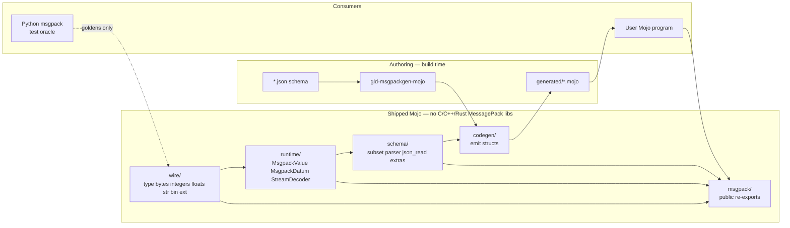

# MessagePack for Mojo (`mojo-messagepack`)

| Field | Value |
| --- | --- |
| **Document title** | MessagePack serializer for the Mojo programming language |
| **Author** | Leonid Ganeline |
| **Date** | 2026-09-10 |
| **Status** | Draft (rev 3) |
| **Target repo** | `/home/leo/PycharmProjects/GLD/gld-messagepack` (greenfield standalone library; only a local `.env` as of 2026-09-10) |
| **License** | MIT, Copyright (c) 2026 Leonid Ganeline |
| **Recommended Mojo pin** | `mojo == 1.0.0` (stable, 2026-08-11) |
| **Spec targets** | [MessagePack specification](https://github.com/msgpack/msgpack/blob/master/spec.md) (2013 types: nil, bool, int/uint, f32/f64, str, bin, array, map, ext/fixext), [timestamp extension type `-1`](https://github.com/msgpack/msgpack/blob/master/spec.md#timestamp-extension-type) (4 / 8 / 12 byte payloads) |
| **Docs** | <https://leo-gan.github.io/gld-messagepack/> |
| **Publish channel** | <https://prefix.dev/leo-gan/leo-gan> |

---

## Overview

There is no from-scratch, schema-driven MessagePack library for Modular Mojo as of 2026-09-10. This document specifies a **standalone, from-scratch Mojo** MessagePack library for the empty `gld-messagepack` repository: independently buildable layers (`wire`, `runtime`, `schema`) plus a `msgpack` facade, a Mojo CLI that reads a JSON Schema subset in-process, generated structs with explicit `encoded_len` / `encode_to` / `decode_from`, and a dynamic `MsgpackValue` tree that can encode and decode any well-formed MessagePack object without a schema.

**Hard product constraint:** the shipped runtime and the codegen walker have **zero C, C++, or Rust MessagePack library dependencies**. They do not wrap, link, FFI, bind, or vendor msgpack-c, msgpack-cxx, rmp, rmp-serde, or serde_json-adjacent MessagePack crates. Python `msgpack` is a **test oracle** only.

v1 ships the full 2013 type set: nil, bool, every int and uint form, IEEE 754 binary32 and binary64, UTF-8 `str`, raw `bin`, array, map, `ext` / `fixext`, a hard error on unused byte `0xc1`, timestamp extension type `-1` (32-bit, 64-bit, and 96-bit layouts), and a `StreamDecoder` that pulls concatenated objects. Both codegen and `MsgpackValue` ship in v1. The timed path is the **generated** path. Default write uses the shortest legal prefix for each value and writes maps with string keys. A schema may request array encoding or integer-key maps.

The first test records (`Message`, `Document`, `Telemetry`, `Strings`, `Event`, `Batch_*`, `LongList`, mutual `A`/`B`) live under this repo’s `testdata/` as ordinary unit and interop test material. They are not the product schema and they are not a dependency on any other repository. Additional schemas cover `bytes`, timestamp, extension, array encoding, and integer-key maps.

This library does **not** depend on `mojo-json`. The schema parser reads JSON Schema files with a small in-repo JSON reader at `src/schema/json_read.mojo`. That reader only needs objects, arrays, strings, numbers, bools, and null.

---

## Background & Motivation

### Why this change is needed

Mojo 1.0 shipped on 2026-08-11 with source stability and ownership. A Mojo program that speaks MessagePack today would have to wrap CPython `msgpack` or link msgpack-c. That measures someone else's runtime, fights Mojo ownership on every `String` / `List` crossing, and violates the no-native-library rule. This repo is a reusable Mojo codec and codegen tool.

The sibling libraries `gld-json`, `gld-cbor`, `gld-protobuf`, and `gld-avro` proved the product shape: pixi + Mojo 1.0, layered packages, generated structs, Python oracle goldens, MkDocs Pages, conda on prefix.dev. MessagePack is a different format. The wire is self-describing (every object starts with a type byte), maps usually have string keys, binary and UTF-8 strings are distinct, and application types travel as `ext`. The schema language in this product is the same JSON Schema subset used by `gld-json`, plus a closed list of MessagePack extras. The product packaging is the same.

### Current state of the repo

- `/home/leo/PycharmProjects/GLD/gld-messagepack` is an empty directory except a local `.env` that holds `PREFIX_API_KEY`. It is not a git repository.
- `leo-gan/gld-messagepack` does not exist on GitHub yet.
- No Modular-Mojo MessagePack package is assumed to exist. This document does not treat the absence as a hard negative proof.

### Pain points this library must not inherit

- A stub that only knows the five v2 test records.
- Any linked C/C++/Rust MessagePack implementation.
- A reflection-only encoder: Mojo reflection sees Mojo fields, not MessagePack type bytes or schema `required`.
- Coupling the library to `serializer-benchmark` or any other monorepo.
- Treating `str` and `bin` as the same type.
- Accepting unused byte `0xc1` as a value.
- Committing `.env` or `temp/`.

---

## Goals & Non-Goals

### Goals (v1 product)

1. **100% from-scratch Mojo** encode/decode of the 2013 MessagePack type set, including `ext` / `fixext`, unused `0xc1` as an error, and timestamp extension type `-1`.
2. Independently buildable layers: `wire/`, `runtime/`, `schema/`, plus `msgpack/` facade. Codegen is a CLI, not a runtime import.
3. Parse the locked JSON Schema subset in Mojo, using an in-repo JSON reader. No host JSON Schema compiler. No dependency on `mojo-json`.
4. CLI `gld-msgpackgen-mojo` emits typed Mojo structs with explicit `encoded_len` / `encode_to` / `decode_from`.
5. Dynamic `MsgpackValue` (arena of nodes) for schema-free encode/decode of any well-formed object.
6. `StreamDecoder` that yields or skips one concatenated object without buffering the rest of the stream.
7. Optional members are `Optional[T]`. Missing map keys and MessagePack `nil` both become `None`. Two-branch `null` unions are `Optional[T]`. Other unions of named objects are tagged Mojo structs whose MessagePack encoding is the selected branch map with no wrapper.
8. Interop on known data with official Python `msgpack`.
9. Decoder walks a `Span[Byte]`. Encoder writes into a `List[Byte]` pre-sized from `encoded_len` when the size is known. Owned `String` / `List[Byte]` on decode.
10. Typed `DecodeError` with `kind: Int`, `offset: Int`, and `field: Int` (`0` means unknown).
11. Independently useful library. Not coupled to any other project.
12. Recursive named types in generated code: detect cycles on the named-type graph with strongly connected components. Emit heap `Box` for any field whose type (after unwrapping optional / array) is in the current type’s SCC. Testdata includes `LongList` and mutual `A`/`B`. Non-optional recursive fields are a codegen error.
13. Timestamp is a first-class type (`MsgpackTimestamp`). Other extension types stay `MsgpackExt(type: Int8, data: List[Byte])`.
14. Default write uses the shortest legal prefix. Decode accepts any valid prefix. Schema may request `map`, `array`, or `intkeys` object encoding.

### Non-goals (v1)

- MessagePack-RPC.
- LZ4 or any other compression framed around MessagePack.
- GPU encode/decode.
- Reflection-driven encode of arbitrary non-generated Mojo structs.
- C/C++/Rust MessagePack libraries, even as an optional path.
- A `serializer-benchmark` client in this repository or as a v1 follow-up.
- A dependency on `mojo-json` or any other sibling conda package at build or runtime.

### Later (explicitly planned, not v1)

- A larger JSON Schema vocabulary (`minimum` / `maximum` / `minLength` / `maxLength` / `minItems` / `pattern` / `additionalProperties`).
- Zero-copy `StringSpan` views on UTF-8 `str` payloads that the caller promises to keep alive.
- Remote `$ref` from a local file catalog (still no network).
- An identity encode mode that preserves overlong prefixes on `MsgpackValue`.

---

## Proposed Design

### Product naming

| Surface | Name | Rationale |
| --- | --- | --- |
| Git repository | `gld-messagepack` | Directory already created; GitHub repo `leo-gan/gld-messagepack` to create. |
| Public Mojo import | `msgpack` | What generated code and apps write (`from msgpack import …`). |
| Conda / pixi package | `mojo-messagepack` | Avoids colliding with conda-forge / PyPI `msgpack`. |
| Codegen CLI | `gld-msgpackgen-mojo` | Matches `gld-jsongen-mojo` / `gld-cborgen-mojo`. |
| Trait | `MsgpackDatum` | Generated test type `Message` keeps the name `Message`. |
| Dynamic tree | `MsgpackValue` | Schema-free arena. |
| Docs site | <https://leo-gan.github.io/gld-messagepack/> | GitHub Pages. |

### Packaging bootstrap (locked)

| Fact | Value |
| --- | --- |
| Initial `pixi.toml` version | `0.1.0`. Intermediate PRs do not bump it. One bump `0.1.0` → `0.2.0` + prefix.dev publish after PRs 1–16 are on `main`. |
| Channels | `https://conda.modular.com/max` and `conda-forge`. |
| Platforms | `["linux-64"]`. |
| Mojo pin | `mojo == 1.0.0` in pixi; recipe build pin `mojo-compiler == 1.0.0`. |
| pixi tasks | `test`, `golden`, `generate`, `precompile`, `check-generated` (same five names as `gld-json/pixi.toml`). Feature `bench` (PR 15) adds task `microbench = "bash scripts/run-microbench.sh"`. |
| `from msgpack import …` | Development: `mojo -I src`. Installed package: `$PREFIX/lib/mojo/msgpack.mojoc` plus the other published `.mojoc` files. Generated code imports only the `msgpack` facade. |
| Oracle extra | pixi feature `oracle` with `python` and `msgpack` for `scripts/gen_golden.py`. Not a runtime dependency. |
| Recipe about | homepage `https://leo-gan.github.io/gld-messagepack/`; repository `https://github.com/leo-gan/gld-messagepack`; license MIT; test via `conda.recipe/test_import.mojo`. |
| Secrets | `.env` and `temp/` are gitignored. `PREFIX_API_KEY` is a GitHub Actions secret and a local file. It is never committed. |
| Publish channel | `https://prefix.dev/leo-gan/leo-gan`. Automatic publish on GitHub Release (`publish.yml`). |

**Precompile order** (`scripts/precompile.sh`). The graph is acyclic: `schema` uses `DecodeError` and may validate a `MsgpackValue`, so it depends on `runtime`. `runtime` does **not** import `schema`. Generated types never parse a schema at runtime.

1. `wire.mojoc` (no in-repo deps)
2. `runtime.mojoc` (needs `wire`)
3. `schema.mojoc` (needs `runtime`; includes `json_read`)
4. `msgpack.mojoc` (needs all of the above)

The CLI is a separate `mojo build` of `src/codegen/cli.mojo` → `gld-msgpackgen-mojo`.

### Four-plus-one layer architecture

```text
gld-messagepack/
├── src/wire/      # type bytes, integers, floats, str/bin, arrays/maps, ext, timestamp
├── src/runtime/   # MsgpackValue, MsgpackDatum, StreamDecoder, options, Box
├── src/schema/    # JSON Schema subset + extras; json_read.mojo
├── src/codegen/   # gld-msgpackgen-mojo
└── src/msgpack/   # public facade
```



### Repository layout

```text
gld-messagepack/
  pixi.toml                      # mojo==1.0.0; optional python+msgpack for oracle only
  pixi.lock
  LICENSE                        # MIT, Copyright (c) 2026 Leonid Ganeline
  README.md
  DESIGN.md                      # this document, committed in PR 1
  .gitignore                     # includes .env and temp/
  src/
    wire/
      __init__.mojo
      reader.mojo                # WireReader over Span[Byte]; 256-way first-byte dispatch
      writer.mojo                # WireWriter into List[Byte]
      int.mojo                   # shortest int/uint prefixes
      float.mojo                 # f32 / f64
      utf8.mojo                  # String(from_utf8=) → DecodeError remap
      ext.mojo                   # ext / fixext headers
      timestamp.mojo             # ext type -1, 4 / 8 / 12 byte payloads
    runtime/
      __init__.mojo
      error.mojo                 # DecodeError
      options.mojo               # EncodeOptions / DecodeOptions
      value.mojo                 # MsgpackValue arena
      datum.mojo                 # trait MsgpackDatum + encode/decode
      box.mojo                   # heap Box[T]
      stream.mojo                # StreamDecoder
      timestamp.mojo             # MsgpackTimestamp
      ext.mojo                   # MsgpackExt
    schema/
      __init__.mojo
      json_read.mojo             # tiny JSON reader (object/array/string/number/bool/null)
      model.mojo                 # SchemaDoc / SchemaType / SchemaProp
      parse.mojo                 # ReadValue → SchemaDoc
      validate.mojo              # instance check on MsgpackValue
      scc.mojo                   # named-type SCC for Box
    codegen/
      __init__.mojo
      names.mojo                 # reserved-name table
      emit.mojo                  # walk model → Mojo source
      cli.mojo                   # gld-msgpackgen-mojo main()
    msgpack/
      __init__.mojo              # public re-exports
  testdata/
    schema/                      # JSON Schema documents for tests and codegen
    golden/                      # oracle .mp + .hex from scripts/gen_golden.py
      README.md                  # which files the script owns vs literal fail bytes
  tests/
    test_*.mojo
    generated/                   # committed output of gld-msgpackgen-mojo
    manual_types.mojo
  tests_interop/
    encode_ref.py
    decode_ref.py
    encode_mojo.mojo             # Mojo encoder whose bytes interop.sh hex-compares
    interop.sh
  examples/
    encode_value.mojo
  benches/
    microbench.mojo              # local n=1 and n=100
  scripts/
    run-tests.sh
    generate.sh
    check-generated.sh
    precompile.sh
    ci-setup.sh
    gen_golden.py
    run-microbench.sh
  conda.recipe/
    recipe.yaml
    test_import.mojo
  docs/
    index.md
    why-messagepack.md
    instructions.md
    examples.md
    techniques.md
    test-data.md
  mkdocs.yml
  requirements-docs.txt
  .github/workflows/
    ci.yml
    pages.yml
    publish.yml
```

`temp/` is not listed. It is gitignored scratch.

### How `from msgpack import` resolves

| Context | Mechanism |
| --- | --- |
| In-repo tests / examples | `mojo run -I src …`. pixi task: `test = "bash scripts/run-tests.sh"`. |
| Generated code | `from msgpack import MsgpackDatum, WireWriter, WireReader, DecodeError` — requires `-I src` (or `MOJOPATH` including `src`). |
| Downstream git checkout | Document `mojo -I path/to/gld-messagepack/src`. |
| After `mojo precompile` / conda | `msgpack.mojoc` installed to `$PREFIX/lib/mojo/`; the compiler auto-discovers it. |

`src/msgpack/__init__.mojo` re-exports the public surface. It does **not** re-export `schema` parse internals or `codegen`. `json_read` is never on the facade.

---

## Mojo 1.0 constraints

These were learned on `gld-cbor` / `gld-json` / `gld-protobuf` / `gld-avro`. Implementers must not rediscover them.

| Topic | What is true in 1.0 | Design consequence |
| --- | --- | --- |
| Functions | Use `def`, not `fn`, in this family’s code. | All snippets in this document use `def`. |
| Tuples | Written `Tuple[T]`, not `(T,)`. | `read` helpers return `Tuple[Int, UInt64]`. |
| Origins | Documented name is `ImmOrigin`. Use `Self.origin`. | `WireReader[origin: ImmOrigin]`. |
| Inits | No `@fieldwise_init` together with a custom `__init__`. | Codegen emits an explicit zero-arg `__init__` and a fieldwise overload. |
| `List` | Not `ImplicitlyCopyable`. No `List[T](a, b)` in some builds. | `append`. Transfer with `append(item^)`. |
| Strings | `String[i]` is a UTF-8 span. Use `as_bytes()` / `[byte=]`. | Key compare is byte-wise. |
| Traits | Decode traits need `Deinitable`. | `MsgpackDatum(Copyable, Movable, Defaultable, Deinitable)`. |
| Keywords | `var` / `match` / `fn` / `struct` clash. | Rename to `struct_`, `fn_`, `var_`. |
| Recursion | Recursive `List[MessageDesc]` may not be `Deinitable`. | Flatten schema members into a side table. `MsgpackValue` is an arena. `Box[T]` is a one-element `List`. |
| Inits | Explicit inits only. | No defaulted fieldwise synthesis. |

`Box[T]` is re-exported from `msgpack`. Implementation matches `gld-json` / `gld-cbor`: a one-element `List[T]` (a raw `Pointer` cell double-frees on copy in Mojo 1.0). API: `__init__(var value: T)` and `__getitem__` returning a copy of `T`.

---

## Wire format (MessagePack 2013)

Every object starts with one type byte. Multi-byte integers and lengths are **big-endian**. There is no surrounding whitespace and no self-delimiting text.

The tables below are the implementation contract. They follow [spec.md](https://github.com/msgpack/msgpack/blob/master/spec.md).

### Type bytes

| First byte | Format | Immediate meaning |
| --- | --- | --- |
| `0x00`–`0x7f` | positive fixint | value is the byte itself, `0` … `127` |
| `0x80`–`0x8f` | fixmap | map of `N = byte & 0x0f` pairs (`0` … `15`) |
| `0x90`–`0x9f` | fixarray | array of `N = byte & 0x0f` elements (`0` … `15`) |
| `0xa0`–`0xbf` | fixstr | UTF-8 string of `N = byte & 0x1f` bytes (`0` … `31`) |
| `0xc0` | nil | null |
| `0xc1` | unused | **always** `DecodeError` (`KIND_UNUSED`) |
| `0xc2` | false | boolean false |
| `0xc3` | true | boolean true |
| `0xc4` | bin 8 | 1-byte length, then that many raw bytes |
| `0xc5` | bin 16 | 2-byte length, then raw bytes |
| `0xc6` | bin 32 | 4-byte length, then raw bytes |
| `0xc7` | ext 8 | 1-byte length, 1-byte signed type, then payload |
| `0xc8` | ext 16 | 2-byte length, 1-byte signed type, then payload |
| `0xc9` | ext 32 | 4-byte length, 1-byte signed type, then payload |
| `0xca` | float 32 | 4-byte IEEE 754 binary32 |
| `0xcb` | float 64 | 8-byte IEEE 754 binary64 |
| `0xcc` | uint 8 | 1-byte unsigned |
| `0xcd` | uint 16 | 2-byte unsigned |
| `0xce` | uint 32 | 4-byte unsigned |
| `0xcf` | uint 64 | 8-byte unsigned |
| `0xd0` | int 8 | 1-byte signed |
| `0xd1` | int 16 | 2-byte signed |
| `0xd2` | int 32 | 4-byte signed |
| `0xd3` | int 64 | 8-byte signed |
| `0xd4` | fixext 1 | 1-byte signed type, 1-byte payload |
| `0xd5` | fixext 2 | 1-byte signed type, 2-byte payload |
| `0xd6` | fixext 4 | 1-byte signed type, 4-byte payload |
| `0xd7` | fixext 8 | 1-byte signed type, 8-byte payload |
| `0xd8` | fixext 16 | 1-byte signed type, 16-byte payload |
| `0xd9` | str 8 | 1-byte length, then UTF-8 |
| `0xda` | str 16 | 2-byte length, then UTF-8 |
| `0xdb` | str 32 | 4-byte length, then UTF-8 |
| `0xdc` | array 16 | 2-byte count, then that many objects |
| `0xdd` | array 32 | 4-byte count, then that many objects |
| `0xde` | map 16 | 2-byte pair count, then that many key/value objects |
| `0xdf` | map 32 | 4-byte pair count, then that many key/value objects |
| `0xe0`–`0xff` | negative fixint | signed value `Int8(byte)`, `−32` … `−1` |

### Default encode: shortest prefix

Encode of a generated value, and default encode of a `MsgpackValue`, writes the shortest legal form. Decode accepts **any** valid form, including overlong integers, overlong `str` / `bin` / array / map headers, and `ext8` where `fixext` would fit.

Integer write of `v: Int64` uses these **disjoint** ranges (first matching row is not required; each value appears once):

| Range | Prefix |
| --- | --- |
| `0` … `127` | positive fixint |
| `−32` … `−1` | negative fixint |
| `128` … `255` | uint 8 |
| `−128` … `−33` | int 8 |
| `256` … `65535` | uint 16 |
| `−32768` … `−129` | int 16 |
| `65536` … `2^32 − 1` | uint 32 |
| `−2^31` … `−32769` | int 32 |
| `2^32` … `Int64.MAX` | uint 64 |
| `Int64.MIN` … `−2^31 − 1` | int 64 |

Integer write of `v: UInt64` greater than `Int64.MAX` is uint 64 (`0xcf` plus eight bytes).

`str` write:

| UTF-8 byte length | Prefix |
| --- | --- |
| `0` … `31` | fixstr |
| `32` … `255` | str 8 |
| `256` … `65535` | str 16 |
| `65536` … cap | str 32 |

`bin` write:

| Length | Prefix |
| --- | --- |
| `0` … `255` | bin 8 |
| `256` … `65535` | bin 16 |
| `65536` … cap | bin 32 |

Array and map headers:

| Count | Array | Map |
| --- | --- | --- |
| `0` … `15` | fixarray | fixmap |
| `16` … `65535` | array 16 | map 16 |
| `65536` … cap | array 32 | map 32 |

`ext` write of type `t: Int8` and payload length `n`:

| `n` | Prefix |
| --- | --- |
| `1` | fixext 1 |
| `2` | fixext 2 |
| `4` | fixext 4 |
| `8` | fixext 8 |
| `16` | fixext 16 |
| `0` … `255` (not a fixext size) | ext 8 |
| `256` … `65535` | ext 16 |
| `65536` … cap | ext 32 |

Generated `Float64` fields write float 64 (`0xcb`). Generated `Float32` does not exist in the schema mapping; `MsgpackValue` kind `F32` writes float 32 (`0xca`) so a generic tree can round-trip a 32-bit float.

### IEEE specials (locked)

MessagePack floats are raw IEEE 754 bits. There is no NaN-canonicalization and no integer-valued-float rewrite.

| Case | Decode | Encode |
| --- | --- | --- |
| Finite, including `−0.0` | store the incoming width and bits (`CK_F32` / `CK_F64`) | write those stored bits at that width |
| `+Inf` / `−Inf` | store the incoming width and bits | write those stored bits |
| NaN (any payload, quiet or signaling) | store the incoming width and bits | write those stored bits; do not quiet, do not shorten |
| Generated `Float64` | see “Generated number fields” below | always `0xcb` plus the `Float64` bits, including NaN payload and signed zero |

`encode_value` of a `CK_F32` / `CK_F64` node writes the stored bits. A generated `Float64` that is NaN or infinite is written as those bits; encode does not raise.

### Integers on decode

- A signed or unsigned encoding whose value fits in `Int64` becomes `MsgpackValue` kind `INT` with that `Int64`. This includes every positive fixint, every uint 8/16/32 whose value is ≤ `Int64.MAX`, and uint 64 when the value is ≤ `Int64.MAX`.
- A uint 64 whose value is in `2^63` … `2^64 − 1` becomes kind `UINT` with a `UInt64`.
- A generated `Int64` field that would need `UINT` raises `KIND_RANGE`.
- A generated `Int64` field that sees float 32 or float 64 raises `KIND_TYPE`. Integers and floats are distinct type bytes.
- Overlong encodings (uint 16 holding `1`, int 64 holding `0`, and so on) are well-formed.

### Generated number fields (locked)

JSON Schema `"type": "number"` is Mojo `Float64` and is **written** as float 64.

Decode of a generated `Float64` field accepts all of the following and converts to `Float64`:

- any integer prefix whose value fits `Int64` (`Float64(v)`)
- any uint 64 that does not fit `Int64` (`Float64` of that `UInt64`; every such value is finite)
- float 32 (widen) and float 64 (bits)

Any other type is `KIND_TYPE`. This matches `validate` (`number` matches `CK_INT` / `CK_UINT` / `CK_F32` / `CK_F64`) and Python `msgpack.packb(1)` (an int) versus `packb(1.0)` (a float 64). `Telemetry.values` and `f_float64` must accept both.

`WireReader.read_f64` stays float-only (f32 or f64). Generated `Float64` fields call `read_as_f64`, which implements the list above. `read_f32` stays float-32-only.

### Strings and binary

`str` is UTF-8. The decoder copies into an owned `String`. `string_from_utf8` catches the default `Error` from `String(from_utf8=)` and raises `DecodeError(KIND_UTF8, offset)`. Never `unsafe_from_utf8`. Never lossy.

`bin` is raw bytes. The decoder copies into an owned `List[Byte]`. There is no UTF-8 check.

A `str` header with invalid UTF-8 is `KIND_UTF8`. A generated `String` field that sees `bin` is `KIND_TYPE`. A generated `List[Byte]` field that sees `str` is `KIND_TYPE`.

Encode of `str` / `bin` is a type-byte (and optional length) followed by a memcpy of the payload. There is no escape step.

### Maps and arrays

An array is an ordered list of objects.

A map is an ordered list of key/value pairs. This is not a `Dict`. Keys may be any MessagePack object on the generic tree. Duplicate keys are well-formed on default decode; **last-key-wins** when projecting to a generated struct or when `MsgpackValue.get` looks up a string key. Optional `DecodeOptions.strict_keys` rejects a second identical key (`KIND_DUP_KEY`). Strict compare for string keys is UTF-8 content. Strict compare for integer keys is the numeric value (`1` as fixint, uint 8, or int 16 is one key). Mixed-type keys (`1` and `"1"`) are distinct. Generated structs only look up the keys the schema named.

`encode_value` writes **every** stored pair in arena order, including duplicates. That is legal MessagePack. Generated structs never emit duplicate keys. There is no write-time duplicate flag on `EncodeOptions`.

Default generated encode writes a **string-key map** in schema property order. `None` optionals **omit** the pair. Unknown keys on decode are **ignored** after a typed key peek (below). Missing required keys are `KIND_SCHEMA`.

For an `Optional[T]` field on a string-key or integer-key map:

| Input | Result |
| --- | --- |
| key absent | `None` |
| key present with MessagePack `nil` | `None` |
| key present with a `T` value | `Some(T)` |
| `nil` on a **required** non-null field | `KIND_TYPE` |

Schema encoding `array` and `intkeys` are specified under Schema extras.

### Depth and size caps

| Cap | Value | Error |
| --- | --- | --- |
| Nesting depth (array / map) | 100 | `KIND_DEPTH` |
| Single `str` or `bin` (and a single `ext` payload) | 64_194_304 | `KIND_RANGE` |
| Array length or map pair count | 1_048_576 | `KIND_RANGE` |
| Stream object count | 1_048_576 | `KIND_RANGE` |
| Input length | `Int` max; a length that does not fit `Int` is `KIND_RANGE` | `KIND_RANGE` |

A length that exceeds remaining input is `KIND_EOF`. Caps are read from `DecodeOptions.max_depth` plus the compile-time size constants above.

### Unused byte `0xc1`

Byte `0xc1` is not a value. Seeing it on any decode path, including `skip_value` and `StreamDecoder`, is `KIND_UNUSED` at that offset.

---

## Timestamp extension type `-1`

Timestamp is first-class. Decode of `ext` type `-1` with a legal payload becomes `MsgpackTimestamp`, not `MsgpackExt`. Encode of `MsgpackTimestamp` writes `ext` type `-1` in the shortest legal layout.

```mojo
struct MsgpackTimestamp(Copyable, ImplicitlyCopyable):
    var sec: Int64
    var nsec: UInt32
```

`nsec` must be in `0` … `999_999_999`. A value outside that range is `KIND_RANGE` on encode and on decode.

### Layouts

All multi-byte fields are big-endian.

**timestamp 32** (payload length 4), stored in `fixext 4` (`0xd6 0xff` plus 4 bytes):

| Bytes | Field |
| --- | --- |
| 4 | unsigned seconds, `0` … `2^32 − 1` |

Nanoseconds are zero. Range is 1970-01-01T00:00:00Z through 2106-02-07T06:28:15Z.

**timestamp 64** (payload length 8), stored in `fixext 8` (`0xd7 0xff` plus 8 bytes):

| Bits | Field |
| --- | --- |
| 30 (high) | unsigned nanoseconds |
| 34 (low) | unsigned seconds |

Seconds range `0` … `2^34 − 1` (through 2514-05-30T01:53:03Z). Nanoseconds must be `< 1_000_000_000`.

**timestamp 96** (payload length 12), stored in `ext 8` (`0xc7 0x0c 0xff` plus 12 bytes):

| Bytes | Field |
| --- | --- |
| 4 | unsigned nanoseconds |
| 8 | signed seconds (`Int64`) |

This layout holds negative seconds and seconds that do not fit in 34 bits.

### Shortest write

| Condition | Layout |
| --- | --- |
| `nsec == 0` and `0 <= sec < 2^32` | timestamp 32 |
| `0 <= sec < 2^34` and `nsec < 2^30` | timestamp 64 |
| otherwise | timestamp 96 |

Decode accepts any of the three lengths for type `-1`. Any other payload length for type `-1` is `KIND_EXT`.

Other extension types stay `MsgpackExt`:

```mojo
struct MsgpackExt(Copyable, Movable, Defaultable, Deinitable):
    var type: Int8
    var data: List[Byte]
```

Type `-1` is reserved for `MsgpackTimestamp` on the generic tree. `decode_value` / `StreamDecoder.next_value` never store type `-1` as `CK_EXT`: a legal 4 / 8 / 12 byte payload becomes `CK_TIMESTAMP`; any other payload length is `KIND_EXT`.

`read_ext` is the raw-ext primitive. It accepts **every** ext type, including `-1`, and returns `MsgpackExt` with the type byte and payload. It does not interpret timestamps.

| Call site | Type `-1` with length 4, 8, or 12 | Type `-1` with any other length | Other ext type |
| --- | --- | --- | --- |
| `decode_value` / stream / `skip_value` | `CK_TIMESTAMP` | `KIND_EXT` | `CK_EXT` |
| `read_timestamp` / generated timestamp field | `MsgpackTimestamp` | `KIND_EXT` | `KIND_TYPE` |
| `read_ext` / generated `"type": "extension"` field | `MsgpackExt(type=-1, data=…)` | `MsgpackExt` (raw; length is not special) | `MsgpackExt` |

A generated extension field therefore accepts a timestamp on the wire as raw ext. `validate` of a tree node for `"type": "extension"` matches `CK_EXT` only, so a `decode_value` timestamp is `VK_TYPE` against an extension schema. That difference is intentional: the tree promotes type `-1`, the raw-ext field does not.

---

## Stream of concatenated objects

A stream is zero or more concatenated MessagePack objects with no extra framing. An empty buffer is a valid empty stream.

```mojo
struct StreamDecoder[origin: ImmOrigin](Movable):
    var reader: WireReader[origin]

    def __init__(out self, data: Span[Byte, Self.origin], *, options: DecodeOptions = DecodeOptions.default)
    def next_value(mut self) raises DecodeError -> Optional[MsgpackValue]
    def skip(mut self) raises DecodeError -> Bool
```

`next_value` returns `None` when no bytes remain. A truncated object is `KIND_EOF`. `skip` returns `False` at the end of the buffer and `True` after skipping one well-formed object. Both methods honor the stream object-count cap.

```mojo
def encode_stream[T: MsgpackDatum](items: List[T], options: EncodeOptions = EncodeOptions.default) -> List[Byte]
def decode_stream[T: MsgpackDatum, origin: ImmOrigin](buf: Span[Byte, origin], options: DecodeOptions = DecodeOptions.default) raises DecodeError -> List[T]
def encode_stream_values(items: List[MsgpackValue], options: EncodeOptions = EncodeOptions.default) -> List[Byte]
def decode_stream_values[origin: ImmOrigin](buf: Span[Byte, origin], options: DecodeOptions = DecodeOptions.default) raises DecodeError -> List[MsgpackValue]
```

There is no trailing-garbage rule for a stream: the decoder consumes objects until the buffer ends.

`decode[T](buf)` and `decode_value(buf)` (single object) **do** require that the buffer contain exactly one object. Leftover bytes are `KIND_TRAILING`.

---

## `MsgpackValue` data model

Mojo 1.0 cannot form a Deinitable recursive enum. `MsgpackValue` is an arena:

```mojo
comptime CK_NIL = 1
comptime CK_FALSE = 2
comptime CK_TRUE = 3
comptime CK_INT = 4
comptime CK_UINT = 5
comptime CK_F32 = 6
comptime CK_F64 = 7
comptime CK_STR = 8
comptime CK_BIN = 9
comptime CK_ARRAY = 10
comptime CK_MAP = 11
comptime CK_EXT = 12
comptime CK_TIMESTAMP = 13

struct MsgpackNode(Copyable, ImplicitlyCopyable):
    var kind: Int
    var a: Int64      # signed int; array/string start; first map key; ext type; timestamp sec
    var b: UInt64     # uint payload, float bits, count, timestamp nsec
    var c: Int        # first map value; unused

struct MsgpackValue(Movable):
    """Arena of MessagePack objects. Nested containers use `kids` as a child-index table."""

    var nodes: List[MsgpackNode]
    var kids: List[Int]
    var texts: List[String]
    var bytes: List[Byte]
    var root: Int

    def __init__(out self):
        self.nodes = List[MsgpackNode]()
        self.kids = List[Int]()
        self.texts = List[String]()
        self.bytes = List[Byte]()
        self.root = 0
```

**Packing (locked):**

| Kind | `a` | `b` | `c` |
| --- | --- | --- | --- |
| `CK_NIL` / `CK_FALSE` / `CK_TRUE` | 0 | 0 | 0 |
| `CK_INT` | `Int64` value | 0 | 0 |
| `CK_UINT` | 0 | `UInt64` value | 0 |
| `CK_F32` | 0 | IEEE bits in the low 32 | 0 |
| `CK_F64` | 0 | IEEE bits | 0 |
| `CK_STR` | start in `texts` | UTF-8 length | 0 |
| `CK_BIN` | start in `bytes` | length | 0 |
| `CK_ARRAY` | first child index in `kids` | count | 0 |
| `CK_MAP` | first **key** index in `kids` | pair count | first **value** index in `kids` |
| `CK_EXT` | `Int8` type as `Int64` | payload length | start in `bytes` |
| `CK_TIMESTAMP` | `sec` | `nsec` | 0 |

Map decode appends all key node indexes into `kids`, then all value node indexes. Pair `i` is `kids[first_key + i]` / `kids[first_value + i]`. Array children are contiguous in `kids`.

Public constructors (each returns a one-root `MsgpackValue`; `msgpack_array` / `msgpack_map` copy child arenas into the new one):

```mojo
def msgpack_nil() -> MsgpackValue
def msgpack_bool(v: Bool) -> MsgpackValue
def msgpack_int(v: Int64) -> MsgpackValue
def msgpack_uint(v: UInt64) -> MsgpackValue   # if v fits Int64, kind is CK_INT
def msgpack_f32(v: Float32) -> MsgpackValue
def msgpack_f64(v: Float64) -> MsgpackValue
def msgpack_str(s: String) -> MsgpackValue
def msgpack_bin(data: List[Byte]) -> MsgpackValue
def msgpack_array(items: List[MsgpackValue]) -> MsgpackValue
def msgpack_map(pairs: List[Tuple[MsgpackValue, MsgpackValue]]) -> MsgpackValue
def msgpack_ext(type: Int8, data: List[Byte]) -> MsgpackValue
def msgpack_timestamp(ts: MsgpackTimestamp) -> MsgpackValue
```

`msgpack_ext(-1, data)` stores `CK_EXT` so tests can build a raw ext node. First-class timestamps are built with `msgpack_timestamp`. Decode of the wire still promotes type `-1` to `CK_TIMESTAMP`.

Read API on `MsgpackValue` (operates on `root`). `validate` and every value test use **only** this API. They do not poke `nodes` / `kids` / `bytes` directly.

```mojo
def kind(self) -> Int
def is_nil(self) -> Bool
def is_bool(self) -> Bool
def is_int(self) -> Bool
def is_uint(self) -> Bool
def is_f32(self) -> Bool
def is_f64(self) -> Bool
def is_str(self) -> Bool
def is_bin(self) -> Bool
def is_array(self) -> Bool
def is_map(self) -> Bool
def is_ext(self) -> Bool
def is_timestamp(self) -> Bool
def as_bool(self) raises DecodeError -> Bool
def as_int(self) raises DecodeError -> Int64
def as_uint(self) raises DecodeError -> UInt64          # CK_INT if >= 0, or CK_UINT
def as_f32(self) raises DecodeError -> Float32          # CK_F32 only
def as_f64(self) raises DecodeError -> Float64          # CK_INT / CK_UINT / CK_F32 / CK_F64
def as_str(self) raises DecodeError -> String
def as_bin(self) raises DecodeError -> List[Byte]
def as_ext(self) raises DecodeError -> MsgpackExt       # CK_EXT only, not CK_TIMESTAMP
def as_timestamp(self) raises DecodeError -> MsgpackTimestamp
def __len__(self) -> Int                                # array length or map pair count
def at(self, i: Int) raises DecodeError -> MsgpackValue                   # array child, copied
def pair(self, i: Int) raises DecodeError -> Tuple[MsgpackValue, MsgpackValue]  # map pair, copied
def get(self, key: String) raises DecodeError -> MsgpackValue             # last-key-wins among string keys
def get_int(self, key: Int64) raises DecodeError -> MsgpackValue          # last-key-wins among integer keys (numeric)
```

A wrong-kind `as_*` or an out-of-range index is `KIND_TYPE`. `get` / `get_int` of a missing key is `KIND_TYPE`. `get` ignores non-string keys. `get_int` ignores non-integer keys and matches `CK_INT` / non-negative values by numeric value.

---

## Mojo 1.0 wire contracts

These names are frozen for codegen.

```mojo
struct WireWriter(Movable):
    var buf: List[Byte]
    var pos: Int
    def __init__(out self, *, capacity: Int = 64, exact: Bool = False)
    def write_byte(mut self, b: Byte)
    def write_bytes[origin: ImmOrigin](mut self, data: Span[Byte, origin])
    def write_nil(mut self)
    def write_bool(mut self, v: Bool)
    def write_i64(mut self, v: Int64)            # shortest prefix
    def write_u64(mut self, v: UInt64)           # shortest prefix
    def write_f32(mut self, v: Float32)
    def write_f64(mut self, v: Float64)
    def write_str(mut self, s: String)           # shortest str header + memcpy
    def write_bin[origin: ImmOrigin](mut self, data: Span[Byte, origin])
    def write_array_header(mut self, count: Int)
    def write_map_header(mut self, count: Int)
    def write_ext[origin: ImmOrigin](mut self, type: Int8, data: Span[Byte, origin])
    def write_timestamp(mut self, ts: MsgpackTimestamp)
    def finish(deinit self) -> List[Byte]

struct WireReader[origin: ImmOrigin](Movable):
    var data: Span[Byte, Self.origin]
    var pos: Int
    var depth: Int
    var options: DecodeOptions
    def __init__(
        out self,
        data: Span[Byte, Self.origin],
        *,
        options: DecodeOptions = DecodeOptions.default,
        depth: Int = 0,
    )
    def remaining(self) -> Int
    def position(self) -> Int
    def peek(self) raises DecodeError -> Byte
    def read_nil(mut self) raises DecodeError
    def read_bool(mut self) raises DecodeError -> Bool
    def read_i64(mut self) raises DecodeError -> Int64
    def read_u64(mut self) raises DecodeError -> UInt64
    def read_f32(mut self) raises DecodeError -> Float32
    def read_f64(mut self) raises DecodeError -> Float64
    def read_str(mut self) raises DecodeError -> String
    def read_bin(mut self) raises DecodeError -> List[Byte]
    def read_array_header(mut self) raises DecodeError -> Int
    def read_map_header(mut self) raises DecodeError -> Int
    def read_ext(mut self) raises DecodeError -> MsgpackExt
    def read_timestamp(mut self) raises DecodeError -> MsgpackTimestamp
    def read_as_f64(mut self) raises DecodeError -> Float64
    def peek_is_str(self) -> Bool
    def peek_is_int(self) -> Bool
    def read_int_key(mut self) raises DecodeError -> Optional[Int64]
    def skip_value(mut self) raises DecodeError
```

`read_i64` accepts any integer prefix whose value fits `Int64` and raises `KIND_RANGE` on uint 64 overflow. `read_u64` accepts any integer prefix whose value is non-negative and fits `UInt64`. `read_f64` accepts float 32 or float 64 and widens. `read_f32` accepts only float 32 (`KIND_TYPE` otherwise). `read_as_f64` accepts any integer prefix (including uint 64 overflow), float 32, or float 64, and is what generated `Float64` fields call. `read_timestamp` accepts only `ext` type `-1` with a legal payload. `read_ext` accepts every ext type, including `-1`. `peek_is_str` is true when the next type byte is fixstr / str 8 / str 16 / str 32. `peek_is_int` is true when the next type byte is a positive or negative fixint or any int/uint prefix. `read_int_key` consumes an integer key: a value that fits `Int64` is `Some(v)`; a uint 64 overflow is `None` (unknown key, caller skips the value). It raises if the next object is not an integer.

`decode`, `decode_value`, `decode_stream`, and `decode_from` are parameterized by `origin` on the input `Span[Byte, origin]`. They take `options: DecodeOptions = DecodeOptions.default` and pass it to `WireReader`. Nesting is capped by `options.max_depth`.

Reader hot paths dispatch on the first byte with a 256-way branch (one arm per type byte, with fixint / fixmap / fixarray / fixstr / negfix grouped). Generated decode uses the same peek.

---

## Runtime API

The generated method is **`decode_from`**, not `merge_from`. MessagePack map replace semantics: the receiver is overwritten. Extra keys are ignored. There is no unknown-field store.

```mojo
trait MsgpackDatum(Copyable, Movable, Defaultable, Deinitable):
    def encoded_len(self, options: EncodeOptions) -> Int
    def encode_to(self, mut w: WireWriter, options: EncodeOptions)
    def decode_from[origin: ImmOrigin](mut self, mut r: WireReader[origin]) raises DecodeError

def encode[T: MsgpackDatum](value: T, options: EncodeOptions = EncodeOptions.default) -> List[Byte]
def encode_into[T: MsgpackDatum](value: T, mut dest: List[Byte], options: EncodeOptions = EncodeOptions.default) -> Int
def decode[T: MsgpackDatum, origin: ImmOrigin](buf: Span[Byte, origin], options: DecodeOptions = DecodeOptions.default) raises DecodeError -> T

def encode_value(value: MsgpackValue, options: EncodeOptions = EncodeOptions.default) -> List[Byte]
def decode_value[origin: ImmOrigin](buf: Span[Byte, origin], options: DecodeOptions = DecodeOptions.default) raises DecodeError -> MsgpackValue

def encoded_str_len(s: String) -> Int
def encoded_bin_len(n: Int) -> Int
def encoded_i64_len(v: Int64) -> Int
def encoded_u64_len(v: UInt64) -> Int
def encoded_array_header_len(count: Int) -> Int
def encoded_map_header_len(count: Int) -> Int
def encoded_ext_len(n: Int) -> Int
def encoded_timestamp_len(ts: MsgpackTimestamp) -> Int
```

`encode` of a generated type walks fields in schema property order.

- Default object encoding writes a string-key map. `None` optionals omit the pair. Keys are baked as the full MessagePack `str` encoding of the property name (header byte plus UTF-8), not as JSON quotes.
- Array-schema types write an array.
- A scalar schema writes that object, not wrapped in a map.
- `encoded_len` uses the same walk as `encode_to`. Two-pass in place.
- `encode_into` resizes `dest` to `encoded_len` and returns the byte count.

Encode of a well-formed generated value does not raise, except `KIND_RANGE` when a `MsgpackTimestamp.nsec` is out of range (a well-formed generated value never holds that). Decode raises `DecodeError`. `decode_from` replaces the receiver. It does not merge.

### `DecodeError` kinds

| Kind | Code | Meaning |
| --- | --- | --- |
| `KIND_EOF` | 1 | truncated |
| `KIND_SYNTAX` | 2 | unexpected prefix that is not `0xc1` |
| `KIND_UNUSED` | 3 | byte `0xc1` |
| `KIND_RANGE` | 4 | length, count, uint 64 overflow for `Int64`, bad `nsec` |
| `KIND_UTF8` | 5 | ill-formed `str` |
| `KIND_TYPE` | 6 | unexpected type for a generated field |
| `KIND_DEPTH` | 7 | nesting cap |
| `KIND_TRAILING` | 8 | extra bytes after one object |
| `KIND_DUP_KEY` | 9 | duplicate key in strict mode |
| `KIND_SCHEMA` | 10 | missing required, `enum` / `const` miss, schema compile, unknown keyword |
| `KIND_EXT` | 11 | type `-1` with a payload length other than 4, 8, or 12 |

`field` is 0 unless a generated struct is filling a numbered member (1-based schema property index).

### Options

```mojo
struct EncodeOptions(Copyable, ImplicitlyCopyable):
    var _reserved: Int

    comptime default = EncodeOptions(_reserved=0)

struct DecodeOptions(Copyable, ImplicitlyCopyable):
    var strict_keys: Bool
    var max_depth: Int

    comptime default = DecodeOptions(strict_keys=False, max_depth=100)
    comptime strict = DecodeOptions(strict_keys=True, max_depth=100)
```

v1 has one write mode: shortest prefixes. `_reserved` exists so the struct is not empty under Mojo 1.0. Generated code takes `options` and ignores `_reserved`. Schema object encoding (`map` / `array` / `intkeys`) is baked into the generated methods; it is not an `EncodeOptions` flag.

Default read is last-key-wins. `strict` rejects duplicates. `WireReader` stores `DecodeOptions` and reads the depth cap from `options.max_depth`. There is no parallel `max_depth` field on the reader.

---

## JSON Schema v1 subset

The schema language is JSON Schema. The parser is in-process Mojo. There is no host `jsonschema` compiler, no network `$ref`, and **no dependency on `mojo-json`**.

### How a schema is loaded

`src/schema/json_read.mojo` is a small JSON reader used only by the schema layer. It accepts objects, arrays, strings, numbers, bools, and null. It rejects comments, trailing commas, unquoted keys, single-quoted strings, `NaN` / `Infinity` tokens, leading zeros, and a leading UTF-8 BOM. Numbers that fit `Int64` stay `Int64`; otherwise a finite `Float64`; otherwise `KIND_RANGE`. The reader builds a private `ReadValue` arena. That type is not on the public facade and is not `MsgpackValue`.

String grammar is RFC 8259 / the gld-json `string.mojo` rules. The decoder copies into an owned `String`.

| Escape | Meaning |
| --- | --- |
| `\"` `\\` `\/` | quote, backslash, slash |
| `\b` `\f` `\n` `\r` `\t` | U+0008, U+000C, U+000A, U+000D, U+0009 |
| `\uXXXX` | one UTF-16 code unit. A high surrogate must be followed by `\uXXXX` low surrogate. The pair becomes one UTF-8 scalar. |
| any other `\x` | `KIND_SYNTAX` (schema reader has no separate `KIND_ESCAPE`; remap to `KIND_SYNTAX`) |
| unescaped control byte `0x00`–`0x1F` | `KIND_SYNTAX` |
| invalid UTF-8 | `KIND_UTF8` |
| lone surrogate | `KIND_SYNTAX` |

Unescaped `/` is legal. `tests/test_json_read.mojo` includes `\"` and 🔥 (surrogate pair).

`schema/parse.mojo` walks the `ReadValue` into `SchemaDoc`. A construct that is JSON but not in this subset is `DecodeError(KIND_SCHEMA, offset)`. A file that is not JSON is a parse `DecodeError` (`KIND_SYNTAX` / `KIND_EOF` / …). There is no separate `SchemaError` type.

The CLI prints `DecodeError` (`kind`, `offset`, `field`) on stderr and exits non-zero. It writes no output files on failure.

CLI:

```bash
gld-msgpackgen-mojo --schema testdata/schema/benchmark_v2.json --out tests/generated
```

`--out` is the directory. The emitter never writes `__init__.mojo` above `--out`. Each named definition becomes `Name.mojo`. The root schema, if it has a `title` or `$id` fragment, becomes that name; otherwise the file stem.

### Keywords accepted (gld-json subset)

| Keyword | Meaning in v1 |
| --- | --- |
| `type` | `"object"` `"array"` `"string"` `"number"` `"integer"` `"boolean"` `"null"`, or a two-element array that is `{T, null}` in either order, **plus** the extras in the next table |
| `properties` | object members |
| `required` | list of property names that are not `Optional` |
| `items` | a single schema for every array element (not a tuple) |
| `$ref` | local only: `#`, `#/$defs/Name`, `#/definitions/Name` |
| `$defs` / `definitions` | named types |
| `enum` | decode-time membership. Field type is the homogeneous JSON type of the values. Mixed-type `enum` is a codegen error. |
| `const` | decode-time equality. |
| `oneOf` / `anyOf` | Two-branch `null` unions (`T` and `null`) become `Optional[T]`. Any other combination is a tagged union if every branch is a named object; otherwise a codegen error. |
| `$id` / `title` / `description` | accepted and ignored except as a name hint |
| `$schema` | accepted and ignored |

Anything else that is not in the extras table (`unevaluatedProperties`, `format`, `pattern`, `minimum`, `additionalProperties`, remote `$ref`, …) is `DecodeError.KIND_SCHEMA`. It is not silently skipped.

### Schema extras (MessagePack only)

These are the **only** additions beyond the gld-json subset.

| Keyword / value | Meaning | Mojo type / wire |
| --- | --- | --- |
| `"type": "bytes"` | binary payload | `List[Byte]` written as `bin` |
| `"type": "extension"` | raw extension | `MsgpackExt` |
| `x-msgpack-timestamp: true` | timestamp ext `-1` | `MsgpackTimestamp`. Wins over `type` for the field’s Mojo type. |
| `x-msgpack-encoding` | object layout | `"map"` (default), `"array"`, or `"intkeys"` |
| `x-msgpack-key` | integer map key | optional per property, JSON integer. Required on every property when the object encoding is `intkeys`. |

Unknown `x-msgpack-*` keys are `KIND_SCHEMA`, the same as any other unknown keyword.

#### Extras validity (locked)

| Construct | Allowed parent | Legal value | Parse error |
| --- | --- | --- | --- |
| `"type": "bytes"` | a field / `$defs` schema | the string `bytes` | — |
| `"type": "extension"` | a field / `$defs` schema | the string `extension` | — |
| `"type": ["bytes", "null"]` or `["null", "bytes"]` | a field / `$defs` schema | two-element type array | any other mix with `bytes` is `KIND_SCHEMA` |
| `"type": ["extension", "null"]` or `["null", "extension"]` | a field / `$defs` schema | two-element type array | any other mix with `extension` is `KIND_SCHEMA` |
| `x-msgpack-timestamp` | a field / `$defs` schema (not the document root unless the root is a field type) | JSON `true` only | missing, `false`, a string, or a number is `KIND_SCHEMA` |
| `x-msgpack-encoding` | an **object** schema (`type` is `object` or `properties` is present) | `"map"`, `"array"`, or `"intkeys"` | any other string, a non-string, or the keyword on a non-object is `KIND_SCHEMA` |
| `x-msgpack-key` | a property schema under `properties` | a JSON integer that fits `Int64` (negative allowed), stored as `Int64` | `1.0` (`Float64` in `json_read`), a string, or a magnitude that does not fit `Int64` is `KIND_SCHEMA` |

Optional wrapping:

- A property not in `required` is `Optional[T]` for every `T`, including `MsgpackTimestamp`, `MsgpackExt`, and `List[Byte]`.
- `"type": ["bytes", "null"]` → `Optional[List[Byte]]`.
- `"type": ["extension", "null"]` → `Optional[MsgpackExt]`.
- `x-msgpack-timestamp: true` plus a two-branch null `type` / `oneOf` / `anyOf` → `Optional[MsgpackTimestamp]`.
- `x-msgpack-timestamp: true` on a non-required property → `Optional[MsgpackTimestamp]`.

`x-msgpack-timestamp: true` wins over `type` for the Mojo type, including `"type": "extension"`.

`enum` / `const` on `bytes`, `extension`, or a timestamp field is `KIND_SCHEMA` at parse time. JSON Schema cannot write those literals without an extra encoding, and v1 does not invent one.

`intkeys` requires `x-msgpack-key` on **every** property. A single property without it is `KIND_SCHEMA`. Duplicate `x-msgpack-key` values in one object are `KIND_SCHEMA`. `x-msgpack-key` on a `map` or `array` encoding is accepted and ignored.

Tagged unions (below) require `map` encoding on every branch. `array` or `intkeys` on a union branch is `KIND_SCHEMA`.

### Object encodings

Default `x-msgpack-encoding` is `"map"`. Encode walks properties in **schema property order**.

| Encoding | Wire | Optional `None` | Container mismatch | Length / key rules |
| --- | --- | --- | --- | --- |
| `map` | map, string keys | omit the pair | not a map → `KIND_TYPE` | unknown keys ignored; last-key-wins; missing required → `KIND_SCHEMA` |
| `intkeys` | map, integer keys from `x-msgpack-key` | omit the pair | not a map → `KIND_TYPE` | unknown keys ignored; last-key-wins by **numeric** value; missing required → `KIND_SCHEMA` |
| `array` | array of every property in schema order | write `nil` (trailing `None`s are **not** omitted) | not an array → `KIND_TYPE` | length must equal the property count (`KIND_TYPE` if not); `nil` on optional → `None`; `nil` on required → `KIND_TYPE` |

#### Generated key peek (locked)

Generated decode never calls `read_str()` or `read_i64()` on a key until the type byte says that is safe. Foreign keys are skipped, not fatal.

**String-key `map`:** if `peek_is_str()`, `read_str()` and match the property name. Otherwise `skip_value()` (the key) then `skip_value()` (the value). An integer key, a `bin` key, or an array key does not fail the object.

**`intkeys`:** if `peek_is_int()`, read the integer. Values that fit `Int64` compare equal when the numbers are equal (`1` as fixint, uint 8, or int 16 is one key). A uint 64 that does not fit `Int64` cannot match any `x-msgpack-key` and is treated as unknown: skip the value. If the key is not an integer, `skip_value()` then `skip_value()`.

**`array`:** no keys. Slot `i` is property `i`. `strict_keys` does not apply.

**`strict_keys`:** generated `map` / `intkeys` `decode_from` reads `r.options.strict_keys`. A second occurrence of a **schema** key is `KIND_DUP_KEY`. Unknown keys are still skipped and do not participate in the duplicate check.

**Expected-order + word-compare** (correctness path may use the generic peek; PR 16 must implement this):

1. A baked string key is the full MessagePack encoding of the property name (header plus UTF-8), for example `"value"` → `a5 76 61 6c 75 65`.
2. A baked int key is the shortest `write_i64` encoding of `x-msgpack-key`.
3. At each map pair, try the next unseen schema key first. If the remaining input starts with that baked encoding, consume those bytes and decode the value.
4. Word-compare: when the baked encoding is exactly 4 or 8 bytes, load those bytes as a little-endian `UInt32` / `UInt64` and compare to the baked literal loaded the same way. Any other length uses `memcmp` of the full baked encoding (header plus payload).
5. On miss, fall back to the typed peek above.

### Codegen mapping

| Schema | Mojo |
| --- | --- |
| `"type": "boolean"` | `Bool` |
| `"type": "integer"` | `Int64` |
| `"type": "number"` | `Float64` (written as float 64; decoded via `read_as_f64`) |
| `"type": "string"` | `String` (`str`, UTF-8 checked) |
| `"type": "bytes"` | `List[Byte]` (`bin`) |
| `"type": "extension"` | `MsgpackExt` |
| `x-msgpack-timestamp: true` | `MsgpackTimestamp` |
| `"type": "null"` | not a field type alone |
| object + `properties` | struct fields. A name not in `required` is `Optional[T]`. Encode omits `None` on `map` / `intkeys`; writes `nil` on `array`. |
| `"type": ["null", T]` or `["T", "null"]` | `Optional[T]` |
| two-branch `oneOf` / `anyOf` with `null` | `Optional[T]` |
| other union of named objects | tagged Mojo struct `{ var tag: Int; … }`. **MessagePack wire is the selected branch map, no wrapper.** |
| `"type": "array", "items": T` | `List[T]` |
| `$ref` to a named def | that Mojo type |
| `enum` of strings / ints | the underlying type plus a decode check |
| `const` | the underlying type plus a decode check |

Identifiers that are Mojo keywords get a trailing underscore (`struct_`, `fn_`, `var_`). A unit test in `tests/test_codegen_names.mojo` feeds a schema with those names.

Recursive named types: mutual reachability on the named-type graph (same SCC). A field whose type, after unwrapping `Optional` / array, is in the current SCC becomes `Box[T]`. Nullable recursive fields are `Optional[Box[T]]` defaulting to `None`. A **non-optional** recursive field is a codegen error. Testdata `LongList` (`next` not required) and mutual `A`/`B` (each field optional) are the positive cases. A schema `{ "properties": { "next": { "$ref": "#" } }, "required": ["next"] }` fails the CLI.

A tagged union whose every branch is recursive is a codegen error; otherwise zero-arg init uses the first non-recursive branch. Mojo 1.0 still rejects *compiling* a struct that names itself through `Box[Self]`; the emitter writes that form and tests check the source.

#### Tagged-union MessagePack wire (locked)

Two named object schemas in `oneOf` / `anyOf` become one Mojo tagged struct. Encode writes the selected branch **as that branch’s map**. There is no `{"tag":…,"value":…}` wrapper and no discriminator property.

Decode saves the reader position, tries each named-object schema **in schema order**, and takes the first **closed** match. `try_match_object` uses the same typed key peek as generated `decode_from`. It succeeds only when all of these hold:

- the value is a map
- every `required` key of that branch is present
- every present key is in that branch’s `properties` (an unknown key is **not** a match)
- each present property type-checks against that branch

A non-str key on a `map` branch is an unknown key: `try_match_object` returns **false** and does not raise. It must not call `read_str()` unless `peek_is_str()` is true. A raised `KIND_TYPE` from `read_str` on an integer key would skip the rewind and fail the whole union.

On failure the reader is rewound and the next branch is tried. If none match, `KIND_TYPE`.

Normal generated `decode_from` on a single object type still **ignores** unknown keys (including non-str keys: skip the pair). Closed matching is only for union branch selection.

Overlapping schemas are a **parse** error (`KIND_SCHEMA` in PR 5). A `SchemaDoc` never contains an overlapping union. Two branches overlap if and only if some map **closed-matches** both: `required(A) ∪ required(B) ⊆ properties(A) ∩ properties(B)` and the types of those shared properties are compatible. `Cat` (`required: [lives]`, properties `name`/`lives`) and `Dog` (`required: [breed]`, properties `name`/`breed`) do **not** overlap. `testdata/schema/union.json` is that pair and must parse. Codegen (PR 9) does not re-check overlap.

```mojo
# oneOf [Cat, Dog] — both objects. Wire is a map {name, lives} or {name, breed}.
def encode_to(self, mut w: WireWriter, options: EncodeOptions):
    if self.tag == 0:
        self.cat.encode_to(w, options)
    else:
        self.dog.encode_to(w, options)

def decode_from[origin: ImmOrigin](mut self, mut r: WireReader[origin]) raises DecodeError:
    var saved = r.position()
    var c = Cat()
    if c.try_match_object(r):
        self.tag = 0
        self.cat = c^
        return
    r.pos = saved
    var d = Dog()
    if d.try_match_object(r):
        self.tag = 1
        self.dog = d^
        return
    raise DecodeError(DecodeError.KIND_TYPE, saved)
```

`try_match_object` is a generated helper, not part of `MsgpackDatum`. It is not on the facade. It is **closed**: a key that is not in that branch’s `properties`, including a non-str key on a `map` branch, makes the helper return false without raising. The same type’s `decode_from` still skips extras.

Emitter writes explicit zero-arg `__init__` (zeros, empty lists, `None`) and a fieldwise overload. No `@fieldwise_init`.

### Instance validation

```mojo
def validate(instance: MsgpackValue, schema: SchemaDoc) -> ValidationResult
def is_valid(instance: MsgpackValue, schema: SchemaDoc) -> Bool
```

```mojo
comptime VK_TYPE = 1
comptime VK_REQUIRED = 2
comptime VK_ENUM = 3
comptime VK_CONST = 4
comptime VK_ITEMS = 5
comptime VK_REF = 6

struct ValidationError(Copyable, ImplicitlyCopyable):
    var path: String    # slash-separated map keys / array indices, not JSON Pointer
    var kind: Int       # VK_*

struct ValidationResult(Movable):
    var valid: Bool
    var errors: List[ValidationError]
```

`validate` never raises for a well-formed instance and schema. It records `VK_*` codes. Generated `decode_from` inlines the same checks as `DecodeError.KIND_TYPE` / `KIND_SCHEMA` and does not call `validate` at runtime.

Type mapping for validation:

| Schema | Matching kinds | Else |
| --- | --- | --- |
| `string` | `CK_STR` | `VK_TYPE` |
| `bytes` | `CK_BIN` | `VK_TYPE` |
| `integer` | `CK_INT` | `CK_UINT` / floats / other → `VK_TYPE` |
| `number` | `CK_INT`, `CK_UINT`, `CK_F32`, `CK_F64` | `VK_TYPE` |
| `boolean` | `CK_TRUE`, `CK_FALSE` | `VK_TYPE` |
| `null` | `CK_NIL` | `VK_TYPE` |
| `extension` | `CK_EXT` only (not `CK_TIMESTAMP`) | `VK_TYPE` |
| timestamp (`x-msgpack-timestamp`) | `CK_TIMESTAMP` | `VK_TYPE` |
| `object` + encoding `map` | `CK_MAP` | `VK_TYPE` |
| `object` + encoding `intkeys` | `CK_MAP` | `VK_TYPE` |
| `object` + encoding `array` | `CK_ARRAY` | `VK_TYPE` |
| `array` | `CK_ARRAY` | `VK_TYPE` |

Object walk and `required` / `properties`:

| Encoding | How a property is found | `required` miss | Extra pairs / slots | Path string |
| --- | --- | --- | --- | --- |
| `map` | last string key equal to the property name | `VK_REQUIRED` | ignored | `/` + property name, for example `/f_bool` |
| `intkeys` | last integer key whose **numeric** value equals `x-msgpack-key` | `VK_REQUIRED` | ignored | `/` + decimal key, for example `/1` or `/-3` |
| `array` | slot `i` is property `i` in schema order | length ≠ property count → `VK_TYPE`; `CK_NIL` in a required slot → `VK_TYPE` | length ≠ property count → `VK_TYPE` | `/` + decimal index, for example `/0` |

Nested paths concatenate (`/items/0/sku`, `/1/0`). The path is slash-separated, not JSON Pointer (no `~` escape).

`enum` / `const` apply only to `string`, `integer`, `number`, and `boolean` (parse already rejects them on `bytes` / `extension` / timestamp). Comparison uses the instance’s decoded value (`as_int` / `as_f64` / `as_str` / `as_bool`). A two-branch null union is valid when the instance is `CK_NIL` or matches `T`.

PR 6 ships one `validate` test per gld-json keyword. PR 10 ships one `validate` test per extra schema (`bytes`, `timestamp`, `ext`, `array_encoding`, `intkeys`).

---

## Generated test-type sketch

`testdata/schema/benchmark_v2.json` `$defs` contains the same *shapes* as the sibling JSON / CBOR libraries. Integer properties are JSON Schema `"integer"` and become `Int64`.

```mojo
from std.collections import List, Optional, Span
from msgpack import (
    MsgpackDatum,
    DecodeError,
    EncodeOptions,
    WireReader,
    WireWriter,
    encoded_str_len,
    encoded_i64_len,
    encoded_map_header_len,
)

# Compact MessagePack map with string keys. Optional next omitted when None.
struct LongList(Copyable, Movable, Defaultable, Deinitable, MsgpackDatum):
    var value: Int64
    var next: Optional[Box[LongList]]

    def encoded_len(self, options: EncodeOptions) -> Int:
        var pairs = 1
        if self.next:
            pairs += 1
        var n = encoded_map_header_len(pairs)
        n += encoded_str_len("value") + encoded_i64_len(self.value)
        if self.next:
            n += encoded_str_len("next")
            n += self.next.value()[].encoded_len(options)
        return n

    def encode_to(self, mut w: WireWriter, options: EncodeOptions):
        var pairs = 1
        if self.next:
            pairs += 1
        w.write_map_header(pairs)
        w.write_bytes(String("\xa5value").as_bytes())   # baked fixstr "value"
        w.write_i64(self.value)
        if self.next:
            w.write_bytes(String("\xa4next").as_bytes())
            self.next.value()[].encode_to(w, options)

    def decode_from[origin: ImmOrigin](mut self, mut r: WireReader[origin]) raises DecodeError:
        var n = r.read_map_header()
        self.value = 0
        self.next = None
        var seen_value = False
        var seen_next = False
        var i = 0
        while i < n:
            if not r.peek_is_str():
                r.skip_value()
                r.skip_value()
                i += 1
                continue
            var key = r.read_str()
            if key == "value":
                if seen_value and r.options.strict_keys:
                    raise DecodeError(DecodeError.KIND_DUP_KEY, r.position())
                self.value = r.read_i64()
                seen_value = True
            elif key == "next":
                if seen_next and r.options.strict_keys:
                    raise DecodeError(DecodeError.KIND_DUP_KEY, r.position())
                if r.peek() == Byte(0xc0):
                    r.read_nil()
                    self.next = None
                else:
                    var child = LongList()
                    child.decode_from(r)
                    self.next = Optional(Box(child^))
                seen_next = True
            else:
                r.skip_value()
            i += 1
        if not seen_value:
            raise DecodeError(DecodeError.KIND_SCHEMA, r.position())
```

The emitter bakes each string key as the exact MessagePack bytes (for `"value"`, six bytes `a5 76 61 6c 75 65`). Expected-order decode (PR 16) peeks those bytes before allocating a `String`. Generated `decode_from` always uses `peek_is_str` before `read_str`. A non-optional `next: LongList` is a CLI error.

#### `intkeys` sketch

Schema: `x-msgpack-encoding: intkeys`, properties `value` with `x-msgpack-key: 1` (required) and `next` with `x-msgpack-key: 2` (optional).

```mojo
def encode_to(self, mut w: WireWriter, options: EncodeOptions):
    var pairs = 1
    if self.next:
        pairs += 1
    w.write_map_header(pairs)
    w.write_i64(1)                    # shortest prefix for key 1
    w.write_i64(self.value)
    if self.next:
        w.write_i64(2)
        self.next.value()[].encode_to(w, options)

def decode_from[origin: ImmOrigin](mut self, mut r: WireReader[origin]) raises DecodeError:
    var n = r.read_map_header()
    self.value = 0
    self.next = None
    var seen_value = False
    var seen_next = False
    var i = 0
    while i < n:
        if not r.peek_is_int():
            r.skip_value()
            r.skip_value()
            i += 1
            continue
        var key_opt = r.read_int_key()
        if not key_opt:
            r.skip_value()
            i += 1
            continue
        var key = key_opt.value()
        if key == 1:
            if seen_value and r.options.strict_keys:
                raise DecodeError(DecodeError.KIND_DUP_KEY, r.position())
            self.value = r.read_i64()
            seen_value = True
        elif key == 2:
            if seen_next and r.options.strict_keys:
                raise DecodeError(DecodeError.KIND_DUP_KEY, r.position())
            if r.peek() == Byte(0xc0):
                r.read_nil()
                self.next = None
            else:
                var child = LongList()
                child.decode_from(r)
                self.next = Optional(Box(child^))
            seen_next = True
        else:
            r.skip_value()
        i += 1
    if not seen_value:
        raise DecodeError(DecodeError.KIND_SCHEMA, r.position())
```

`read_int_key` returning `None` (uint 64 overflow) treats the pair as unknown: skip the value. It does not fail the object.

#### `array` sketch

Same two fields, `x-msgpack-encoding: array`. Encode always writes both slots. `None` is `nil`. Trailing optionals are not dropped.

```mojo
def encoded_len(self, options: EncodeOptions) -> Int:
    var n = encoded_array_header_len(2)
    n += encoded_i64_len(self.value)
    if self.next:
        n += self.next.value()[].encoded_len(options)
    else:
        n += 1                        # 0xc0
    return n

def encode_to(self, mut w: WireWriter, options: EncodeOptions):
    w.write_array_header(2)
    w.write_i64(self.value)
    if self.next:
        self.next.value()[].encode_to(w, options)
    else:
        w.write_nil()

def decode_from[origin: ImmOrigin](mut self, mut r: WireReader[origin]) raises DecodeError:
    var n = r.read_array_header()     # KIND_TYPE if the object is not an array
    if n != 2:
        raise DecodeError(DecodeError.KIND_TYPE, r.position())
    self.value = r.read_i64()
    if r.peek() == Byte(0xc0):
        r.read_nil()
        self.next = None
    else:
        var child = LongList()
        child.decode_from(r)
        self.next = Optional(Box(child^))
```

---

## Performance plan

### The bar

The timed path is generated `MsgpackDatum.encode` / `decode` (or `encode_into`), not `MsgpackValue` and not reflection. v1 does **not** add a `serializer-benchmark` client. Speed work is a local pass plus research, recorded by `benches/microbench.mojo` at `n=1` and `n=100` for `Message`, `Document`, `Telemetry`, `Strings`, and `Event`.

There is no competitor ratio gate. The speed PR lands when the named methods below are implemented and the microbench runs on linux-64.

### Named methods (locked)

| Method | Where | Why |
| --- | --- | --- |
| Pre-sized `WireWriter` | `encoded_len` then `exact=True` | one allocation; no geometric growth |
| Baked key literals | codegen `write_bytes` of the full `str` encoding | no runtime header math on known keys |
| memcpy `str` / `bin` | `WireWriter.write_bytes` / `write_str` / `write_bin` | payload is already UTF-8 or raw |
| 256-way first-byte dispatch | `WireReader` peek / `skip_value` / generic decode | one branch per type byte |
| Expected-order decode | generated maps | writers emit schema property order |
| `encode_into` reuse | public helper | caller keeps one `List[Byte]` |
| Word-compare short keys | generated decode | 4- and 8-byte keys compared as integers |
| `array` / `intkeys` when the schema says | generated encode/decode | skip string keys entirely |

### Local microbench

`benches/microbench.mojo` plus `scripts/run-microbench.sh`. Fixed-seed encode/decode of the generated suite structs at `n=1` and `n=100`. Times `encode_into` and `decode`. Prints ops/s. Does not fail CI on a ratio. Numbers are not published on the docs home page.

### What the speed PR will not do

- Link msgpack-c or any other native codec.
- Time `MsgpackValue` as the product bar.
- Add a client under `serializer-benchmark`.
- Change the public trait or the wire tables.

---

## API / Interface Changes

This is a greenfield library. There is no previous public API.

After install:

```mojo
from msgpack import encode, decode, MsgpackValue, DecodeError, EncodeOptions
```

Development checkout:

```bash
pixi run mojo run -I src tests/test_int.mojo
```

Public facade (`src/msgpack/__init__.mojo`):

```text
WireWriter WireReader
DecodeError EncodeOptions DecodeOptions
MsgpackDatum MsgpackValue Box
MsgpackTimestamp MsgpackExt
StreamDecoder
encode encode_into decode encode_value decode_value
encode_stream decode_stream encode_stream_values decode_stream_values
encoded_str_len encoded_bin_len encoded_i64_len encoded_u64_len
encoded_array_header_len encoded_map_header_len encoded_ext_len encoded_timestamp_len
validate is_valid SchemaDoc ValidationResult
msgpack_nil msgpack_bool msgpack_int msgpack_uint msgpack_f32 msgpack_f64
msgpack_str msgpack_bin msgpack_array msgpack_map msgpack_ext msgpack_timestamp
```

`schema` parse helpers used only by the CLI may stay out of the facade. `json_read` stays out of the facade. `codegen` is never a runtime import.

---

## Data Model Changes

No persistent database. On-disk artifacts:

| Path | Role |
| --- | --- |
| `testdata/schema/` | JSON Schema documents for tests and codegen |
| `testdata/golden/` | oracle `.mp` + `.hex` from `scripts/gen_golden.py`, plus literal fail bytes |
| `testdata/golden/README.md` | which files the script owns |
| `tests/generated/` | output of `gld-msgpackgen-mojo` (checked in, drift-checked) |

Do not hand-edit `.mp` / `.hex` files that `gen_golden.py` owns. Regenerate those with `pixi run golden` (needs the `oracle` feature). Fail-path files (`0xc1`, truncated headers, overlong lengths, invalid UTF-8 `str`, timestamp `-1` with length 3) are **literal bytes** written by the script, the same way `gld-cbor` writes half-float / indefinite cases. They are not `packb` output. `testdata/golden/README.md` lists which names the script owns.

---

## Test data

`testdata/schema/benchmark_v2.json` `$defs` contains `Message`, `Document`, `DocumentMeta`, `DocumentItem`, `Telemetry`, `Strings`, `Event`, `EventAttr`, `Batch_Message`, `Batch_Document`, `Batch_Telemetry`, `Batch_Strings`, `Batch_Event`. Field names follow the **gld-json DESIGN.md table** and `seriailizer-benchmark/mojo/src/bench/data.mojo` records. They do **not** copy whatever is currently committed under `gld-json/testdata/schema/benchmark_v2.json` or `gld-cbor/testdata/cddl/benchmark_v2.cddl` (those shipped files are smaller).

| Type | Fields |
| --- | --- |
| `Message` | `f_bool`, `f_int32`, `f_int64`, `f_float64`, `f_string`, `f_bool_2`, `f_int32_2`, `f_string_2` |
| `DocumentMeta` | `region`, `version` |
| `DocumentItem` | `sku`, `qty`, `price_minor` |
| `Document` | `id`, `status`, `meta`, `items` |
| `Telemetry` | `source`, `ts`, `tags`, `values` |
| `Strings` | `items` |
| `EventAttr` | `key`, `value` |
| `Event` | `event_id`, `event_type`, `occurred_at`, `producer`, `attrs` |
| `Batch_*` | `items` array of the inner type |

Integer JSON Schema properties become `Int64` even when the name says `int32`. That matches `gld-json`.

Additional schema files:

| File | Why |
| --- | --- |
| `longlist.json` | recursive `next` not required → `Optional[Box[LongList]]` |
| `mutual_ab.json` | mutual optional records |
| `keywords.json` | Mojo keyword identifiers |
| `union.json` | tagged union of two named objects |
| `optional.json` | missing / `nil` / `["null","string"]` |
| `enum_const.json` | `enum` and `const` |
| `bytes.json` | `"type": "bytes"` → `List[Byte]` / `bin` |
| `timestamp.json` | `x-msgpack-timestamp` → `MsgpackTimestamp` |
| `ext.json` | `"type": "extension"` → `MsgpackExt` |
| `array_encoding.json` | `x-msgpack-encoding: array` |
| `intkeys.json` | `x-msgpack-encoding: intkeys` plus `x-msgpack-key` |

`scripts/gen_golden.py` writes two kinds of files (documented in `testdata/golden/README.md`):

**From Python `msgpack.packb`** (`use_bin_type=True`; timestamps via `msgpack.Timestamp`):

- atoms: `nil`, `true`, `false`, `0`, `127`, `128`, `−1`, `−32`, `−33`, `Int64` min/max, uint 64 `2^64 − 1` (generic tree only), `1.5` as float 64
- empty / nested arrays and maps
- `str`: empty, ASCII, UTF-8 🔥
- `bin`: empty, raw bytes that are not valid UTF-8
- timestamp 32 / 64 / 96 (from `msgpack.Timestamp` values that select those layouts)
- `Message` with `f_string = "hi"`
- concatenated two-object stream (`packb` of each object, then concatenate)

**Literal bytes** (not `packb` output; the script writes hex constants, like gld-cbor’s half-float / indef files):

- `0xc1` must-fail
- truncated headers, overlong claimed length, invalid UTF-8 `str`, timestamp `-1` with length 3
- float 32 payload (`0xca` plus four IEEE bits). Default `packb` writes float 64. The f32 golden is either literal bytes or `packb(..., use_single_float=True)` — the README says which. Decode tests accept it; encode-side interop of a generated `Float64` still expects float 64.
- `fixext` / `ext8` that are not type `-1` may be `packb` of `msgpack.ExtType` or literal bytes.

The word “fixtures” is not used in this repository.

### Interop harness

`tests_interop/` pipes atoms, maps, `bin`, timestamps, streams, generated `Message`, and one `intkeys` vector through Python `msgpack`.

| File | Role |
| --- | --- |
| `encode_mojo.mojo` | Mojo encoder. `interop.sh` runs it and hex-compares the bytes to `encode_ref.py`. Required because this design claims byte equality, the same as `gld-cbor`. |
| `encode_ref.py` | `msgpack.packb(..., use_bin_type=True)` |
| `decode_ref.py` | `msgpack.unpackb(...)` with the flags below |
| `interop.sh` | hex-compare encode; decode each golden through both sides |

Oracle flags (locked):

| Flag | Value | Why |
| --- | --- | --- |
| `use_bin_type` | `True` on `packb` | `bin` vs `str` |
| `timestamp` | default / `0` on `unpackb` | yields `msgpack.Timestamp`. **Do not use `timestamp=3`:** that is `datetime.datetime` (UTC) and drops nanoseconds above microseconds. |
| `strict_map_key` | `False` | default Python `unpackb` is `True` and rejects integer keys. Required for `intkeys` and any generic non-string key. |
| `use_single_float` | `True` only for the f32 golden | default `packb` writes float 64 |

Encode side: Mojo bytes from `encode_mojo.mojo` must equal `packb` for the locked shortest forms (atoms, string-key maps, generated `Message`, timestamps that Python also shortest-encodes). Decode side: Mojo `decode_value` must accept `packb` output. intkeys is included in interop with `strict_map_key=False`; it is not Mojo-only.

Python `msgpack` is a test-only dependency (pixi feature `oracle`). It is never imported from Mojo.

---

## Docs pages

Copy the structure, voice, and card grid of the `gld-json` / `gld-cbor` docs template. Material theme. House style: `/home/leo/.grok/skills/improve-docs/references/STYLE.md` (textbook sentences, one idea then the reason, no slang, no slogan stacks).

| Page | File | Role |
| --- | --- | --- |
| Home | `docs/index.md` | card grid, install, import name |
| Why MessagePack | `docs/why-messagepack.md` | type bytes, int/uint, str vs bin, maps, ext, timestamp, streams |
| Instructions | `docs/instructions.md` | codegen CLI, schema subset, encodings, Optional, errors |
| Examples | `docs/examples.md` | `MsgpackValue`, generated `Message`, stream, timestamp |
| Techniques | `docs/techniques.md` | the eight named speed methods |
| Test data | `docs/test-data.md` | every testdata tree |

Pages nav labels match those titles. Site URL: `https://leo-gan.github.io/gld-messagepack/`.

---

## Conda and publish

Copy `gld-json` `conda.recipe/recipe.yaml`, `test_import.mojo`, `ci.yml`, `pages.yml`, `publish.yml`, and `.gitignore`, renaming binaries and homepage.

`conda.recipe/recipe.yaml` builds on `linux-64` with `mojo-compiler == 1.0.0`. `scripts/precompile.sh` emits `wire.mojoc` → `runtime.mojoc` → `schema.mojoc` → `msgpack.mojoc`, then `mojo build src/codegen/cli.mojo -o $PREFIX/bin/gld-msgpackgen-mojo`. The recipe test imports `msgpack` **and** runs `gld-msgpackgen-mojo --help`.

`.github/workflows/publish.yml` is a copy of gld-json’s: `on: release` plus `workflow_dispatch`; `prefix-dev/rattler-build-action@v0.2.39`; `rattler-build upload prefix --skip-existing -c leo-gan/leo-gan`; secret `PREFIX_API_KEY`.

`.github/workflows/ci.yml` passes `PREFIX_API_KEY` into **CI** pixi steps (Modular channel 401), not only into publish. The key is never printed.

`.gitignore` is a copy of gld-json’s: `.env`, `temp/`, `.pixi/`, `*.mojoc`, `site/`, `output/`, plus the usual editor and Python lines.

The recipe does **not** depend on `mojo-json`. Intermediate PRs do not bump the version. After PRs 1–16 are on `main`, one bump `0.1.0` → `0.2.0` creates the Release that starts `publish.yml`.

---

## Security & Privacy

The decoder is a parser of untrusted bytes.

- Every length is bounds-checked against remaining input before allocation.
- Depth 100, `str` / `bin` / `ext` 64_194_304, and array / map 1_048_576 stop zip-bomb-style nesting and huge payloads.
- `0xc1` is never treated as a value.
- No eval of MessagePack bytes. Schema `$ref` is local-only. A schema cannot pull a URL.
- `.env` is gitignored so `PREFIX_API_KEY` never enters the repository.

---

## Observability

No production metrics and no metrics daemon. Failures are `DecodeError` with `kind` and `offset`. Tests print those fields. CI is GitHub Actions: Mojo tests, generated-check, docs build, precompile smoke. Publish logs live on the Release workflow.

Local speed work logs ops/s from `benches/`. Those numbers are not published on the docs home page.

---

## Rollout Plan

1. Create `leo-gan/gld-messagepack` public after the first local green test.
2. Protect `main`: no force-push, no deletion, require a PR. Same as `gld-json` / `gld-cbor`.
3. Land PRs 1–16 on `main` without version bumps.
4. Enable Pages (`build_type: workflow`) when the Pages workflow exists.
5. Set GitHub secret `PREFIX_API_KEY` from the local `.env` (never print it). Use the same secret in CI pixi steps.
6. After PR 16, bump `0.1.0` → `0.2.0` once. That creates the GitHub Release, which starts `publish.yml`.
7. Rollback of a bad Release is “yank / skip-existing and ship the next tag”. The library has no feature flags.

**Publish is blocked** until PRs 1–16 are on `main` and CI is green.

### CI (copy `gld-json`, rename binaries and homepage)

- `.github/workflows/ci.yml`: copy of gld-json. pixi + Mojo 1.0 `pixi run test`, `pixi run check-generated`, `precompile` smoke, `mkdocs build --strict`. `PREFIX_API_KEY` is available to pixi install.
- `.github/workflows/pages.yml`: Material theme, same palette and card-grid nav as `gld-json` / `gld-cbor`.
- `.github/workflows/publish.yml`: copy of gld-json (`workflow_dispatch`, `prefix-dev/rattler-build-action@v0.2.39`, upload to `leo-gan/leo-gan`, secret `PREFIX_API_KEY`).

---

## Alternatives Considered

| Alternative | Trade-off | Decision |
| --- | --- | --- |
| Wrap msgpack-c / msgpack-cxx / rmp | Faster to a stub; forbidden by the from-scratch rule | Rejected |
| Depend on `mojo-json` for schema parse | Reuses a sibling; this package would not be independently buildable | Rejected; in-repo `json_read.mojo` |
| CDDL instead of JSON Schema | Matches `gld-cbor`; splits the family’s schema language | Rejected; user locked the gld-json subset plus extras |
| Generic-only, no codegen | Smaller; worse Mojo types; cannot hit a generated-path speed pass | User locked both |
| Codegen-only | Faster; cannot inspect an unknown value | User locked both |
| Reflection of arbitrary structs | Less code; cannot bake keys or `Box` recursion | Rejected for v1 and for the timed path |
| Always-array object encoding | Compact; surprises authors who expect maps | Default is string-key maps; array is opt-in via schema |
| Host `jsonschema` CLI for codegen | Avoids a parser; leaks a non-Mojo toolchain | User locked in-Mojo schema |
| Couple testdata to `serializer-benchmark` | DRY; violates standalone | Rejected; shapes are copied into `testdata/` |
| Keep overflowing uint 64 as a generated `UInt64` field | Preserves bits; the locked integer field type is `Int64` | Rejected for generated fields; `KIND_RANGE`. The generic tree still has `CK_UINT`. |

---

## Risks

| Risk | Severity | Mitigation |
| --- | --- | --- |
| JSON Schema extras drift from gld-json | High | Copy the gld-json keyword table; extras are a closed list in this document |
| `json_read` silently becomes a second JSON library | Medium | Closed grammar; not on the facade; no pretty-print, no JSON Lines |
| Mojo 1.0 Deinitable recursion | High | Arena nodes; `Box` only on generated SCC fields |
| Timestamp layout mistakes vs Python `msgpack` | High | Goldens for 4 / 8 / 12 byte payloads; oracle `unpackb` default / `timestamp=0` (`msgpack.Timestamp`) |
| `str` vs `bin` confusion | Medium | Distinct kinds; `use_bin_type=True` in goldens; `KIND_TYPE` on mismatch |
| Duplicate-key last-wins vs strict | Medium | Default last-wins; tests for both |
| Sibling bench client leaks into this repo | Medium | Testdata is copied shapes; no import of `serializer-benchmark`; no client planned |
| Writer timeout / large first PR | Low | Incremental PRs; wire first |
| uint 64 overflow surprises | Medium | Documented: generated `Int64` is `KIND_RANGE`; tree keeps `CK_UINT` |

---

## Open Questions

None. Product answers were locked before this document.

---

## Key Decisions

1. **100% from-scratch Mojo.** No C/C++/Rust MessagePack libraries at runtime or in shipped codegen. Python `msgpack` is a test oracle only.
2. **Standalone library.** Not coupled to `serializer-benchmark`. v2 record shapes live in `testdata/` as ordinary test data. The word “fixtures” is not used.
3. **License MIT**, copyright (c) 2026 Leonid Ganeline. Public GitHub `leo-gan/gld-messagepack`. Incremental PRs to `main`. GitHub Pages + CI. Conda package `mojo-messagepack` on `https://prefix.dev/leo-gan/leo-gan`.
4. **Import `msgpack`**, package `mojo-messagepack`, CLI `gld-msgpackgen-mojo`, trait `MsgpackDatum`, tree `MsgpackValue`, repo `gld-messagepack`.
5. **Pin `mojo == 1.0.0`.** Initial package version `0.1.0`. Intermediate PRs do not bump. One bump `0.1.0` → `0.2.0` + prefix.dev publish after PRs 1–16.
6. **`.env` and `temp/` are gitignored.** `PREFIX_API_KEY` is local plus a GitHub Actions secret.
7. **Full 2013 spec in v1:** nil, bool, all int/uint forms, f32/f64, str, bin, array, map, ext/fixext, `0xc1` error, timestamp ext `-1` (4/8/12 byte), `StreamDecoder`. Out of v1: RPC, LZ4, GPU, reflection of arbitrary structs.
8. **Both APIs in v1.** Codegen and `MsgpackValue`. The timed path is generated.
9. **JSON Schema subset is parsed in Mojo.** Same keywords as gld-json, plus the extras table. No host schema compiler. **Do not depend on `mojo-json`.** Schema parse uses `src/schema/json_read.mojo` (objects, arrays, strings, numbers, bools, null only).
10. **Optional members are `Optional[T]`.** Missing key and MessagePack `nil` both become `None`. `{"type":["null","T"]}` / two-branch null `oneOf`/`anyOf` map to `Optional[T]`. Other unions of named objects are tagged Mojo structs whose encoding is the selected branch map (no wrapper). `try_match_object` is closed and uses the same typed key peek as `decode_from`; a non-str key on a `map` branch returns false and does not raise. Normal `decode_from` still ignores extras. Overlapping union branches are parse-time `KIND_SCHEMA` (PR 5). Overlap iff some map closed-matches both branches.
11. **Duplicate keys:** last-key-wins on default read. Optional strict mode rejects (`KIND_DUP_KEY`).
12. **Integers:** value fits `Int64` → `CK_INT` / generated `Int64`. uint 64 overflow → `CK_UINT` on the tree and `KIND_RANGE` on a generated `Int64` field. Generated `Int64` rejects floats (`KIND_TYPE`). Generated `Float64` decodes via `read_as_f64` (any int/uint prefix plus f32/f64) and always encodes as float 64.
13. **Timestamp is first-class.** Other ext is `MsgpackExt(type: Int8, data: List[Byte])`.
14. **Default write** is shortest prefixes plus string-key maps. Schema may request `array` or `intkeys`.
15. **Recursive named types use heap `Box`.** SCC, not “self or enclosing.” Non-optional recursive fields are a codegen error.
16. **Docs follow the gld-json template**, including `techniques.md`. Pages: Why MessagePack, Instructions, Examples, Techniques, Test data.
17. **Decoder walks `Span[Byte]`.** Encoder writes a `List[Byte]` pre-sized from `encoded_len`. Owned `String` / `List[Byte]` on decode. `DecodeError` has `kind`, `offset`, `field` (`0` = unknown).
18. **Interop** is official Python `msgpack` with `use_bin_type=True`, `unpackb` default / `timestamp=0` (`msgpack.Timestamp`, not `timestamp=3` datetime), and `strict_map_key=False` (required for intkeys). Encode-side byte equality goes through `tests_interop/encode_mojo.mojo`. Fail-path goldens are literal bytes. f32 goldens use `use_single_float=True` or raw bytes.
19. **Protect `main`** after the repo exists: no force-push, no deletion, require PR.
20. **CI copies `gld-json`** `ci.yml` / `pages.yml` / `publish.yml` / `.gitignore` / recipe test, renaming binaries and homepage. `PREFIX_API_KEY` is in CI pixi steps and in publish. Recipe test runs `gld-msgpackgen-mojo --help`. Publish uses `workflow_dispatch` and `prefix-dev/rattler-build-action@v0.2.39`. Gitignore includes `.pixi/`, `*.mojoc`, `site/`, `output/`.
21. **Encode of well-formed generated values does not raise.** Decode raises `DecodeError`. `decode_from` replaces. Unknown keys are skipped after a typed peek (`peek_is_str` / `peek_is_int`); a foreign key type does not fail the object. Single-object `decode` rejects trailing bytes. `StreamDecoder` consumes the whole buffer as objects. `encode_value` writes every stored map pair, including duplicates. Generated structs never emit dups. Floats write stored IEEE bits (NaN payload, ±Inf, signed zero).
22. **Codegen emits explicit zero-arg `__init__` plus a fieldwise overload. No `@fieldwise_init`.**
23. **`decode` / `decode_value` / `decode_stream` take `DecodeOptions`.** `WireReader` stores that struct; depth is `options.max_depth`.
24. **Layers:** `src/wire/` (no deps) → `src/runtime/` (wire) → `src/schema/` (runtime + `json_read`) → `src/msgpack` facade. Precompile in that order. CLI is `mojo build src/codegen/cli.mojo`.
25. **Speed:** local pass plus research. Named methods: pre-sized writer, baked keys, memcpy str/bin, 256-way first-byte dispatch, expected-order decode, `encode_into` reuse, word-compare short keys, array/intkeys when the schema says. `benches/microbench.mojo` at `n=1` and `n=100`. No `serializer-benchmark` client.
26. **Platforms `linux-64` only.** Channels `https://conda.modular.com/max` and `conda-forge`.
27. **Generated encodings:** `map` peeks str keys and skips other key types; `intkeys` compares numeric `Int64` (`read_int_key`); `array` requires exact property-count length (`KIND_TYPE` otherwise) and writes `nil` for every `None`, including trailing. `strict_keys` is honored on generated `map` / `intkeys`. `read_ext` / generated extension fields accept type `-1` as raw `MsgpackExt`; the tree still promotes legal `-1` to `CK_TIMESTAMP`.
28. **PR split.** Schema parse and `json_read` land before `validate`. Recursion/unions/optional/enum land before extras (`bytes` / timestamp / ext / array / intkeys). The conda PR depends on the extras PR. Publish waits for PRs 1–16.

---

## References

- [MessagePack spec](https://github.com/msgpack/msgpack/blob/master/spec.md) — type bytes, containers, ext, timestamp.
- [Python msgpack](https://github.com/msgpack/msgpack-python) — test oracle only.
- Sibling product shape: `/home/leo/PycharmProjects/GLD/gld-json/DESIGN.md` (JSON Schema subset, docs template). Binary-wire analog: `/home/leo/PycharmProjects/GLD/gld-cbor/DESIGN.md`.
- House style: `/home/leo/.grok/skills/improve-docs/references/STYLE.md`.

---

## PR Plan

PRs land in `/home/leo/PycharmProjects/GLD/gld-messagepack`. Each is independently reviewable. Intermediate PRs do not bump the version. **Bump `0.1.0` → `0.2.0` / prefix.dev publish is blocked until PRs 1–16 are on `main`.**

There is no `serializer-benchmark` follow-up in this plan.

### PR 1 — Repo bootstrap

- **Title:** `chore: bootstrap pixi project and empty layers`
- **Files:** `pixi.toml`, `pixi.lock`, `LICENSE`, `README.md`, `DESIGN.md`, `.gitignore`, `src/{wire,runtime,schema,codegen,msgpack}/__init__.mojo`, `scripts/{ci-setup,run-tests,check-generated,generate,precompile}.sh`
- **Depends on:** none
- **Changes:** Version `0.1.0`. Pin `mojo == 1.0.0`. Channels `https://conda.modular.com/max` and `conda-forge`. `platforms = ["linux-64"]`. MIT license, Copyright (c) 2026 Leonid Ganeline. Commit this `DESIGN.md`. pixi tasks: `test`, `golden`, `generate`, `precompile`, `check-generated`. Feature `oracle` (`python`, `msgpack`) for later goldens. Feature `bench` and task `microbench` land in PR 15. `.gitignore` is a copy of gld-json’s (`.env`, `temp/`, `.pixi/`, `*.mojoc`, `site/`, `output/`). Placeholder import test. Creating `leo-gan/gld-messagepack` and protecting `main` are rollout steps, not files in this PR.

### PR 2 — Wire atoms

- **Title:** `feat(wire): nil, bool, int, uint, float, str, bin`
- **Files:** `src/wire/{reader,writer,int,float,utf8}.mojo`, `src/runtime/error.mojo`, `src/runtime/options.mojo`, `tests/test_int.mojo`, `tests/test_float.mojo`, `tests/test_str.mojo`, `tests/test_bin.mojo`, `tests/test_atom.mojo`, `scripts/gen_golden.py`, `testdata/golden/`, `testdata/golden/README.md`
- **Depends on:** PR 1
- **Changes:** Cursor reader/writer with `DecodeOptions` on `__init__`. Shortest integer and `str` / `bin` prefixes. 256-way first-byte dispatch for atoms. Reject `0xc1` (`KIND_UNUSED`). UTF-8 check on `str` only. Caps on single `str` / `bin`. `gen_golden.py` writes `packb(..., use_bin_type=True)` goldens **and** literal fail bytes (`0xc1`, truncated, overlong, invalid UTF-8). README lists which files the script owns.

### PR 3 — Containers, ext, timestamp

- **Title:** `feat(wire): arrays, maps, ext, fixext, timestamp`
- **Files:** `src/wire/{reader,writer,ext,timestamp}.mojo`, `src/runtime/{timestamp,ext}.mojo`, `tests/test_container.mojo`, `tests/test_ext.mojo`, `tests/test_timestamp.mojo`
- **Depends on:** PR 2
- **Changes:** Nested arrays/maps, depth cap from `options.max_depth`, count cap, `skip_value`. `ext` / `fixext`. `read_ext` accepts type `-1` as raw `MsgpackExt`. Timestamp `-1` layouts 4 / 8 / 12 and shortest write. Last-key-wins helper used later by generated decode. Literal golden for timestamp length 3.

### PR 4 — `MsgpackValue` + stream

- **Title:** `feat(runtime): MsgpackValue arena and StreamDecoder`
- **Files:** `src/runtime/{value,stream}.mojo`, `src/msgpack/__init__.mojo`, `tests/test_value.mojo`, `tests/test_stream.mojo`
- **Depends on:** PR 3
- **Changes:** Arena decode of any object, including `CK_UINT` and first-class `CK_TIMESTAMP`. Frozen constructor + `as_*` / `at` / `pair` / `get` / `get_int` read API. `encode_value` writes all map pairs, including duplicates. `encode_stream` takes `EncodeOptions`. `StreamDecoder.next_value` / `skip`. Empty buffer is a valid empty stream. Single-object `decode_value` still rejects trailing bytes.

### PR 5 — `json_read` + schema parse

- **Title:** `feat(schema): json_read and JSON Schema subset parser`
- **Files:** `src/schema/{json_read,model,parse,scc}.mojo`, `tests/test_json_read.mojo`, `tests/test_schema_parse.mojo`, `testdata/schema/`
- **Depends on:** PR 4
- **Changes:** Tiny JSON reader (objects/arrays/strings/numbers/bools/null; RFC 8259 string escapes; test `\"` and 🔥). Walk `ReadValue` into `SchemaDoc`. Accept the locked gld-json keywords plus the extras validity table. Unknown keywords are `KIND_SCHEMA`, not silent skip. SCC on named types. Overlapping union branches are parse-time `KIND_SCHEMA`; a `SchemaDoc` never contains an overlapping union. No `validate` in this PR. No import of `mojo-json`.

### PR 6 — Schema instance validation

- **Title:** `feat(schema): instance validation for the v1 subset`
- **Files:** `src/schema/validate.mojo`, `tests/test_schema_validate.mojo`
- **Depends on:** PR 5
- **Changes:** `validate` / `is_valid` on `MsgpackValue` via the public read API only. `VK_*` codes. One test per gld-json keyword (`type`, `properties`, `required`, `items`, local `$ref`, `enum`, `const`, two-branch null unions). Extra-schema validate tests wait for PR 10.

### PR 7 — `MsgpackDatum` + hand-written Message

- **Title:** `feat(runtime): MsgpackDatum and manual Message round-trip`
- **Files:** `src/runtime/{datum,box}.mojo`, `tests/manual_types.mojo`, `tests/test_roundtrip_manual.mojo`, `tests/test_box.mojo`
- **Depends on:** PR 4
- **Changes:** Trait + `Box` + `encode_into` + `encoded_*_len`. Human-written `Message` matching testdata field names, baked string keys, `peek_is_str` + `strict_keys`, shortest prefixes. Byte-compare to Python golden.

### PR 8 — Codegen emitter

- **Title:** `feat(codegen): gld-msgpackgen-mojo emitter`
- **Files:** `src/codegen/{cli,emit,names}.mojo`, `scripts/generate.sh`, `scripts/check-generated.sh`, `testdata/schema/benchmark_v2.json`, `testdata/schema/keywords.json`, `tests/generated/`, `tests/test_codegen_names.mojo`, `tests/test_benchmark_v2.mojo`
- **Depends on:** PR 5, PR 7
- **Changes:** Emit structs, optionals (omit `None` on maps; missing/`nil` → `None`), lists, baked keys, `peek_is_str` fallback decode. `--schema` path. `check-generated.sh` fails on drift for `Message`. Keyword-identifier test. Generated `Float64` uses `read_as_f64`.

### PR 9 — Generated recursion and unions

- **Title:** `feat(codegen): LongList, mutual A/B, tagged unions, optional, enum`
- **Files:** `testdata/schema/{longlist,mutual_ab,union,optional,enum_const}.json`, `tests/generated/`, `tests/test_longlist.mojo`, `tests/test_mutual_ab.mojo`, `tests/test_union.mojo`, `tests/test_optional.mojo`, `tests/test_enum_const.mojo`, `scripts/generate.sh`, `scripts/check-generated.sh`
- **Depends on:** PR 8
- **Changes:** SCC `Box`. Reject non-optional recursion. Tagged-union encode is the bare branch map; `try_match_object` is closed and uses `peek_is_str` (non-str key → false, no raise). Overlap is already rejected at parse (PR 5); codegen does not re-check. `Cat`/`Dog` parse and compile. `optional.json` covers missing vs `nil` vs `["null","string"]`. `enum_const.json` has a named test.

### PR 10 — Schema extras codegen

- **Title:** `feat(codegen): bytes, timestamp, ext, array encoding, intkeys`
- **Files:** `testdata/schema/{bytes,timestamp,ext,array_encoding,intkeys}.json`, `tests/generated/`, `tests/test_bytes.mojo`, `tests/test_timestamp_gen.mojo`, `tests/test_ext_gen.mojo`, `tests/test_array_encoding.mojo`, `tests/test_intkeys.mojo`, `tests/test_schema_validate.mojo` (extra cases), `scripts/generate.sh`, `scripts/check-generated.sh`
- **Depends on:** PR 6, PR 9
- **Changes:** `"type": "bytes"` / `extension`, `x-msgpack-timestamp`, `array` (exact length, `nil` for `None`), `intkeys` (`read_int_key`, numeric compare, `x-msgpack-key` required on every property). One `validate` test per extra schema.

### PR 11 — Interop harness

- **Title:** `test: Mojo ↔ official Python msgpack interop`
- **Files:** `tests_interop/{encode_ref.py,decode_ref.py,encode_mojo.mojo,interop.sh}`
- **Depends on:** PR 3, PR 8, PR 10
- **Changes:** `encode_mojo.mojo` hex-compared to `packb(..., use_bin_type=True)`. `unpackb` uses default / `timestamp=0` and `strict_map_key=False`. Pipe atoms, maps, `bin`, timestamps, streams, generated `Message`, and one intkeys vector. f32 golden via `use_single_float` or raw bytes. Do not claim RPC or LZ4.

### PR 12 — Docs skeleton, CI, Pages

- **Title:** `docs: skeleton, CI, and Pages`
- **Files:** `docs/*`, `mkdocs.yml`, `requirements-docs.txt`, `.github/workflows/{ci,pages}.yml`, `examples/encode_value.mojo`
- **Depends on:** PR 8
- **Changes:** Copy gld-json workflows, renaming binaries and homepage. Material theme. Enable GitHub Pages (`build_type: workflow`). CI runs tests + `check-generated` + `mkdocs build --strict` and passes `PREFIX_API_KEY` to pixi. **Skeleton only:** index card grid, Why MessagePack outline, Instructions outline, Examples placeholder, Techniques outline, Test data. These pages must not claim extras as shipped until PR 13.

### PR 13 — Test-data documentation + examples + techniques

- **Title:** `docs: test data, examples, and techniques`
- **Files:** `docs/{test-data,instructions,examples,index,why-messagepack,techniques}.md`
- **Depends on:** PR 10, PR 11, PR 12
- **Changes:** Why MessagePack teaches the 2013 type bytes, str vs bin, maps, ext, timestamp, and streams. Upgrade Instructions/Examples to the locked v1 surface. Techniques documents the eight named speed methods. Explain every testdata tree.

### PR 14 — Conda recipe and publish workflow

- **Title:** `build: conda recipe and mojo precompile`
- **Files:** `conda.recipe/recipe.yaml`, `conda.recipe/test_import.mojo`, `scripts/precompile.sh`, `.github/workflows/publish.yml`
- **Depends on:** PR 10, PR 11, PR 12
- **Changes:** Precompile `wire` → `runtime` → `schema` → `msgpack`, then `gld-msgpackgen-mojo`. Pin `mojo-compiler == 1.0.0`. Recipe `about.homepage` is `https://leo-gan.github.io/gld-messagepack/`. Recipe test: import + `gld-msgpackgen-mojo --help`. Copy gld-json `publish.yml` (`workflow_dispatch`, `prefix-dev/rattler-build-action@v0.2.39`). No dependency on `mojo-json`. Do not bump the version in this PR.

### PR 15 — Local microbench harness

- **Title:** `bench: generated-path microbench`
- **Files:** `benches/microbench.mojo`, `scripts/run-microbench.sh`, `pixi.toml` (feature `bench`)
- **Depends on:** PR 8, PR 9
- **Changes:** Task `microbench = "bash scripts/run-microbench.sh"`. Fixed-seed encode/decode for the generated suite structs at `n=1` and `n=100`. Times `encode_into` / `decode`. Prints ops/s. Does not fail on a ratio. Not published to Pages. No EmberJson or `serializer-benchmark` dependency.

### PR 16 — Speed pass

- **Title:** `perf: generated-path speed pass`
- **Files:** `src/wire/{reader,writer,int}.mojo`, `src/codegen/emit.mojo` (bake / word-compare / expected-order), `benches/`
- **Depends on:** PR 15
- **Changes:** Implement any named method that is not already in: confirm pre-size, memcpy str/bin, 256-way dispatch, expected-order decode, `encode_into` reuse, word-compare of 4- and 8-byte baked encodings, honor schema `array` / `intkeys`. Research notes stay in `docs/techniques.md` if measurements change a sentence. This PR does not bump the version.

Publish to prefix.dev happens after PR 16 via a single bump `0.1.0` → `0.2.0`, **once**, and **only** when PRs 1–16 are on `main`.
